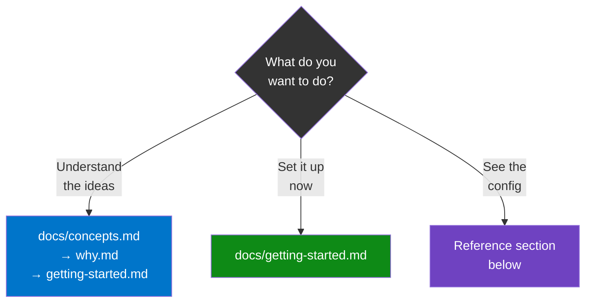
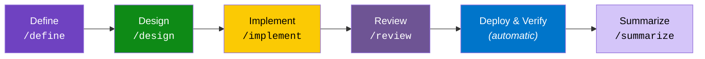

# Directives

A system for defining repeatable AI-driven processes — teams, roles, **[pipelines](docs/glossary.md)** (structured workflows that prevent skipping steps), and review protocols — that you can adopt incrementally. Start with better AI reviews in 15 minutes, or build out a full multi-agent organization.

The system is team-agnostic. Engineering is the first fully-built team, but the same scaffolding works for sales, marketing, operations — any team where work benefits from structured review.

**New here?** See [which path fits you](#where-to-start), or jump to the [FAQ](docs/faq.md).

---

## Problems This Solves

| Problem | How Directives addresses it |
|---------|----------------------------|
| **AI agents skip steps under pressure** | A [pipeline](docs/glossary.md) defines every stage from requirements to delivery. GitHub labels track progress. Skip a stage and the system warns you. |
| **Generic AI feedback is shallow** | [Personas](docs/glossary.md) (detailed character profiles — backstory, expertise, review lens) produce targeted, deep feedback instead of "looks good, maybe add some checks." |
| **One agent reviews its own work** | The architecture separates builder and validator [agent types](docs/glossary.md). Different agents — or isolated sessions — catch different blind spots. |
| **Process lives in tribal knowledge** | [Manifests](docs/glossary.md) (YAML config files) are the single source of truth for teams, roles, stages, and vocabularies. Machine-readable, version-controlled, no drift. |
| **Setting up takes too long** | Three adoption levels let you start small. Use personas alone in 15 minutes. Add the pipeline when you're ready. Split agents later. |

---

## Where to Start

### Adoption levels

| Level | What you get | Time |
|-------|-------------|------|
| **Quick start** | Better AI reviews using persona definitions — zero config | 15 min |
| **Standard** | Structured pipeline with labels, stage gates, and repeatable process | 30 min |
| **Full system** | Builder/validator split across different LLM providers (the AI tools that do the work) for independent review | 1 hour |

Each level builds on the last. See [Getting Started](docs/getting-started.md) for setup instructions.

### Learn more

| Doc | What you'll learn | Time |
|-----|-------------------|------|
| [**Key Concepts**](docs/concepts.md) | Agent types, personas, pipeline, committee, manifests | 10 min |
| [**Why This Architecture?**](docs/why.md) | The problems and thinking behind each decision | 10 min |
| [**Glossary**](docs/glossary.md) | One-line definitions for every term | 3 min |
| [**FAQ**](docs/faq.md) | "Do I need all of this?", "Engineering only?", and more | 3 min |

---

## How It Works

A task flows through six [pipeline](docs/glossary.md) stages. Each stage produces artifacts the next one consumes:

### Personas and the committee

A **[committee](docs/glossary.md)** of [personas](docs/glossary.md) — specialists with distinct professional backgrounds — reviews work at the Design and Review stages. Each persona reads all prior feedback before adding their own, building cumulative insight rather than repeating observations.

The engineering team has 11 personas. Each brings a different lens:

| Persona | Focus |
|---------|-------|
| UX Designer | Accessibility, design systems |
| Software Engineer | Code quality, patterns |
| System Architect | Coupling, scalability |
| Data Engineer | Migrations, query performance |
| AI/ML Engineer | LLM safety, prompt risks |
| Security Engineer | Vulnerabilities, auth bypass |
| QA Engineer | Test coverage, edge cases |
| SRE | Ops, health checks, logging |
| Writer | User-facing copy, docs |
| Engineering Manager | Synthesizes all feedback |

Other teams define their own personas and review sequences — the structure is identical, only the expertise changes.

### Builder and validator

The architecture separates work into two [agent types](docs/glossary.md): a **builder** (creates work — implements, produces, deploys) and a **validator** (reviews independently — audits, checks quality, flags issues). When backed by different LLM providers, they bring different training and biases, catching things the other misses. Even with a single provider, isolated sessions prevent the validator from inheriting the builder's blind spots.

---

## Reference

### Architecture

Three config files drive the system at different scopes:

| File | Scope | What it controls |
|------|-------|-----------------|
| [`agents.yml`](agents.yml) | Global | Agent types, LLM providers, assignments, fallback chains |
| [`manifest.yml`](teams/engineering/manifest.yml) | Per-team | Role roster, pipeline stages, labels, vocabularies |
| `CONTRIBUTING.md` | Per-project | Team reference, pipeline mode, provider overrides |

### Teams

Each team gets its own [manifest](docs/glossary.md), personas, pipeline, and vocabulary. Engineering is the first fully-built team — see [`teams/engineering/`](teams/engineering/) for the complete example, including [personas](teams/engineering/personas/), [process docs](teams/engineering/process/), and [manifest](teams/engineering/manifest.yml). To create a new team, copy [`teams/TEMPLATE/`](teams/TEMPLATE/) and customize.

### Global framework

Cross-team rules for how agents think and coordinate: [agent architecture](framework/agent-architecture.md), [orchestration](framework/orchestration.md), [reasoning](framework/reasoning-framework.md), [safety](framework/safety.md).

### Templates

Starter files for new projects: [`CONTRIBUTING.md`](templates/CONTRIBUTING.md.template), [`CLAUDE.md`](templates/CLAUDE.md.template), [`GEMINI.md`](templates/GEMINI.md.template), [`worklog`](templates/worklog.md.template), [`pm-context`](templates/pm-context.md.template).

### Domain overlays

Optional domain-specific rules layered on top of the base process. Currently available: [healthcare](overlays/healthcare/) (HIPAA, PHI handling, patient safety).

### Three-tier model

Configuration lives at three levels, each adding specificity without duplicating the tier above:

| Tier | Where | What |
|------|-------|------|
| **1. Directives** (this repo) | `suniljames/directives` | Team scaffolding, personas, framework, templates |
| **2. Organization** (optional) | `<org>/.github` or org-level repo | Domain compliance, org-specific workflows, shared CI |
| **3. Project** | Each project repo | Tech stack, architecture, environment config |
