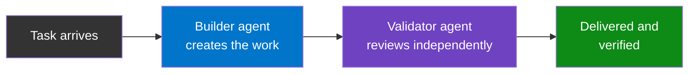
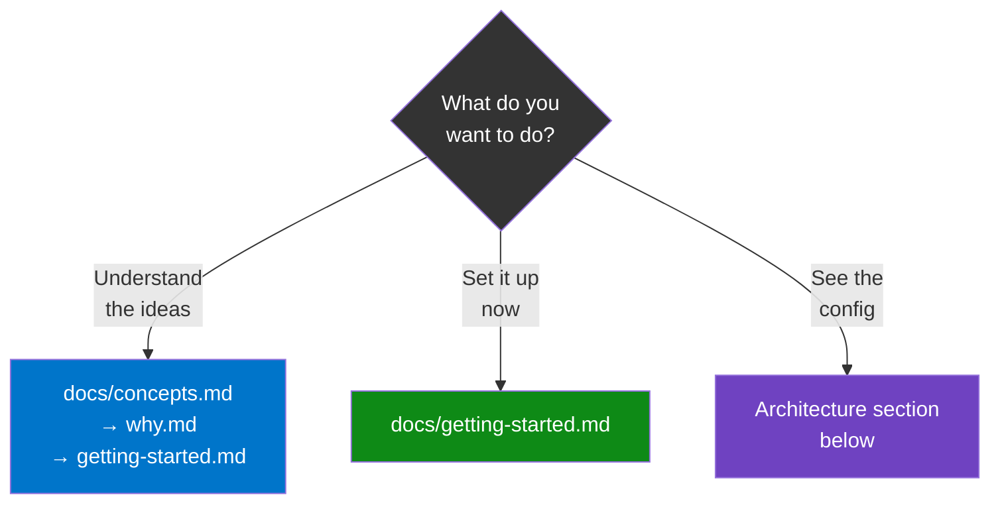
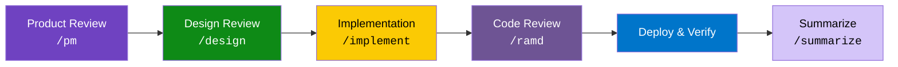

# Directives

When an AI agent builds something and then reviews its own work, it misses the same things twice. This repo fixes that by splitting the work: one agent builds, a different agent reviews. Each gets **[personas](docs/glossary.md)** (character profiles that shape how it thinks) and a **[pipeline](docs/glossary.md)** (a structured workflow that prevents skipping steps).

The result: deeper reviews, fewer blind spots, and a repeatable process for any team — not just engineering.



**New here?** See [which path fits you](#where-to-start), or jump to the [FAQ](docs/faq.md).

---

## Where to Start



| Doc | What you'll learn | Time |
|-----|-------------------|------|
| [**Key Concepts**](docs/concepts.md) | Agent types, personas, pipeline, committee, manifests | 10 min |
| [**Why This Architecture?**](docs/why.md) | Problems this solves and thinking behind each decision | 10 min |
| [**Getting Started**](docs/getting-started.md) | Three adoption levels: personas only → pipeline → multi-agent | 15 min |
| [**Glossary**](docs/glossary.md) | One-line definitions for every term | 3 min |
| [**FAQ**](docs/faq.md) | "Do I need all of this?", "Engineering only?", and more | 3 min |

---

## How It Works

A task flows through six **[pipeline](docs/glossary.md)** stages. Each stage produces artifacts the next one consumes:



A **[committee](docs/glossary.md)** of [personas](docs/glossary.md) — specialists with distinct professional backgrounds — reviews work sequentially. Each reads all prior feedback before adding their own:

| Persona | Focus |
|---------|-------|
| UX Designer | Accessibility, design systems |
| Software Engineer | Code quality, patterns |
| System Architect | Coupling, scalability |
| Data Engineer | Migrations, query performance |
| AI/ML Engineer | LLM safety, prompt risks |
| Security Engineer | Vulnerabilities, auth bypass |
| QA Engineer | Test coverage, edge cases |
| SRE | Ops, health checks, logging |
| Writer | User-facing copy, docs |
| Engineering Manager | Synthesizes all feedback |

Other teams define their own personas and review sequences. Engineering is the first fully-built team — not the only one the system supports.

---

## Architecture

Three config files drive the system. Each has a different scope and changes at a different rate:

```
  agents.yml                 manifest.yml               CONTRIBUTING.md
  (global)                   (per-team)                 (per-project)
  +------------------+      +------------------+       +------------------+
  | Agent types      |      | Role roster      |       | Team reference   |
  | LLM providers    | <--- | Pipeline stages  | <--- | Pipeline mode    |
  | Assignments      |      | Vocabularies     |       | Provider overrides|
  | Fallback chains  |      | Settings         |       |                  |
  +------------------+      +------------------+       +------------------+
```

| File | Scope | What it controls |
|------|-------|-----------------|
| [`agents.yml`](agents.yml) | Global | Agent types, LLM providers, assignments, fallback chains |
| [`manifest.yml`](teams/engineering/manifest.yml) | Per-team | Role roster, pipeline stages, labels, vocabularies |
| `CONTRIBUTING.md` | Per-project | Team reference, pipeline mode, provider overrides |

---

## Teams

Each team gets its own [manifest](docs/glossary.md), personas, pipeline, and vocabulary.

### Engineering

> **Manifest:** [`teams/engineering/manifest.yml`](teams/engineering/manifest.yml)

**Personas** — [`teams/engineering/personas/`](teams/engineering/personas/)

| Role | Agent | Persona |
|------|-------|---------|
| UX Designer | Builder | [`ux-designer.md`](teams/engineering/personas/ux-designer.md) |
| Software Engineer | Builder | [`software-engineer.md`](teams/engineering/personas/software-engineer.md) |
| System Architect | Builder | [`system-architect.md`](teams/engineering/personas/system-architect.md) |
| Data Engineer | Builder | [`data-engineer.md`](teams/engineering/personas/data-engineer.md) |
| AI/ML Engineer | Builder | [`ai-ml-engineer.md`](teams/engineering/personas/ai-ml-engineer.md) |
| Security Engineer | Validator | [`security-engineer.md`](teams/engineering/personas/security-engineer.md) |
| QA Engineer | Validator | [`qa-engineer.md`](teams/engineering/personas/qa-engineer.md) |
| SRE | Builder | [`sre.md`](teams/engineering/personas/sre.md) |
| Writer | Validator | [`writer.md`](teams/engineering/personas/writer.md) |
| Engineering Manager | Builder | [`engineering-manager.md`](teams/engineering/personas/engineering-manager.md) |
| PM | Validator | [`pm.md`](teams/engineering/personas/pm.md) |

Shared culture: [`cross-cutting-traits.md`](teams/engineering/personas/cross-cutting-traits.md)

**Process** — [`teams/engineering/process/`](teams/engineering/process/)

| Doc | Description |
|-----|-------------|
| [`pipeline.md`](teams/engineering/process/pipeline.md) | 6-stage pipeline, ad-hoc work gate, label lifecycle |
| [`committee-process.md`](teams/engineering/process/committee-process.md) | Committee review protocol, fresh-eyes validation |
| [`code-review-framework.md`](teams/engineering/process/code-review-framework.md) | Severity levels, review lenses |
| [`test-budget.md`](teams/engineering/process/test-budget.md) | Test layer decision framework |
| [`prd-template.md`](teams/engineering/process/prd-template.md) | Product requirements format |

### Adding a New Team

Copy `teams/TEMPLATE/` → `teams/<your-team>/` and customize. See the [template manifest](teams/TEMPLATE/manifest.yml) for field docs.

---

## Global Framework

Applies across all teams — how agents think and coordinate.

| Doc | Description |
|-----|-------------|
| [`agent-architecture.md`](framework/agent-architecture.md) | Agent types, provider assignments, single-provider fallback |
| [`orchestration.md`](framework/orchestration.md) | How orchestrators consume config files to route work |
| [`reasoning-framework.md`](framework/reasoning-framework.md) | AI reasoning loop, task modes, complexity triggers |
| [`safety.md`](framework/safety.md) | Universal safety guardrails |

---

## Templates

Starter files for new project repos:

| Template | Description |
|----------|-------------|
| [`CONTRIBUTING.md.template`](templates/CONTRIBUTING.md.template) | Project entry point |
| [`CLAUDE.md.template`](templates/CLAUDE.md.template) | Builder agent config |
| [`GEMINI.md.template`](templates/GEMINI.md.template) | Validator agent config |
| [`worklog.md.template`](templates/worklog.md.template) | Multi-agent coordination log |
| [`pm-context.md.template`](templates/pm-context.md.template) | Domain context for PM persona |

---

## Domain Overlays

Optional additions for domain-specific projects. Additive — they extend the base process, never replace it.

| Overlay | Description |
|---------|-------------|
| [`overlays/healthcare/`](overlays/healthcare/) | HIPAA, PHI handling, patient safety |

---

## Three-Tier Model

Configuration lives at three levels. Each adds specificity without duplicating the tier above.

| Tier | Where | What |
|------|-------|------|
| **1. Directives** (this repo) | `suniljames/directives` | Team scaffolding, personas, framework, templates |
| **2. Organization** (optional) | `<org>/.github` or org-level repo | Domain compliance, org-specific workflows, shared CI |
| **3. Project** | Each project repo | Tech stack, architecture, environment config |
