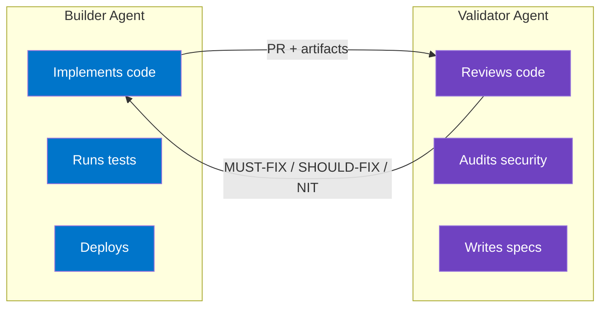
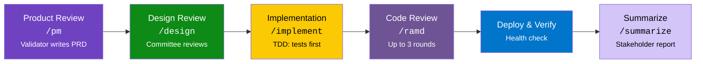

# Directives

A manifest-driven system for orchestrating AI agents across teams. Personas give agents depth. Pipelines give them structure. Splitting builder and validator agents gives them independence.

While engineering is the first fully-built team, the architecture is designed for any team that uses AI agents — sales, marketing, operations, support, and beyond. Each team gets its own manifest, personas, pipeline, and vocabulary. The scaffolding is team-agnostic; the content is team-specific.

## The Problem

AI agents are powerful — but when one model both creates and reviews its own work, it creates correlated failures. In engineering, the model that wrote a SQL query won't notice it's injectable during review. In sales, the model that drafted a proposal won't catch the pricing error during QA. Same blind spots in every phase.

## The Solution



Split the work across two independent AI agent types. Give each agent **personas** — detailed character profiles that shape how it thinks. Connect everything through a **pipeline** that ensures nothing gets skipped. The pattern works for any domain: engineering personas review code, but the same structure supports sales personas reviewing proposals or marketing personas reviewing campaigns.

**New here? Start with the [guide](#guide).**

---

## How It Works

A GitHub issue flows through six pipeline stages, each producing artifacts the next stage consumes:



The engineering team's committee — 11 personas, each with a distinct professional background and review lens — evaluates work sequentially, building on each other's feedback. Other teams define their own personas and review sequences:

```
  UX Designer ──> Software Eng ──> Architect ──> Data Eng ──> AI/ML Eng
       |               |              |             |            |
       v               v              v             v            v
  accessibility    code quality    coupling     migrations    LLM safety
  design system    patterns        scalability  query perf    prompt risks
                                                                 |
  Security Eng ──> QA Engineer ──> SRE ──> Writer ──> Eng Manager
       |               |           |         |            |
       v               v           v         v            v
  vulnerabilities  test coverage  ops     user-facing   synthesizes
  auth bypass      edge cases     health  copy/docs     all feedback
  data exposure    test layers    logs    errors        makes final call
```

---

## Guide

New to this repo? Read these in order:

| Doc | What you'll learn | Time |
|-----|-------------------|------|
| [**Key Concepts**](docs/guide/concepts.md) | Agent types, personas, pipeline, committee, manifests — all the terminology | 10 min |
| [**Why This Architecture?**](docs/guide/why.md) | The problems this solves and the thinking behind each design decision | 10 min |
| [**Getting Started**](docs/guide/getting-started.md) | Three levels of adoption: personas only, pipeline, or full multi-agent setup | 15 min |

---

## Architecture

Three config files drive the entire system:

```
  agents.yml                 manifest.yml               CONTRIBUTING.md
  (global)                   (per-team)                 (per-project)
  +------------------+      +------------------+       +------------------+
  | Agent types      |      | Role roster      |       | Team reference   |
  | LLM providers    | <--- | Pipeline stages  | <--- | Pipeline mode    |
  | Assignments      |      | Vocabularies     |       | Provider overrides|
  | Fallback chains  |      | Settings         |       |                  |
  +------------------+      +------------------+       +------------------+
```

| File | Scope | What it controls |
|------|-------|-----------------|
| [`agents.yml`](agents.yml) | Global | Agent types, LLM providers, default assignments, fallback chains |
| [`teams/engineering/manifest.yml`](teams/engineering/manifest.yml) | Per-team | Role roster, pipeline stages, labels, controlled vocabularies |
| Per-project `CONTRIBUTING.md` | Per-project | Team reference, pipeline mode, provider overrides |

---

## Teams

The system supports multiple teams, each with its own manifest, personas, pipeline, and vocabulary. Engineering is fully built out below. To add a new team (sales, marketing, etc.), copy `teams/TEMPLATE/` and customize — see [Adding a New Team](#adding-a-new-team).

### Engineering

> **Manifest:** [`teams/engineering/manifest.yml`](teams/engineering/manifest.yml)

**Personas** — [`teams/engineering/personas/`](teams/engineering/personas/)

| Role | Agent | Persona |
|------|-------|---------|
| UX Designer | Builder | [`ux-designer.md`](teams/engineering/personas/ux-designer.md) |
| Software Engineer | Builder | [`software-engineer.md`](teams/engineering/personas/software-engineer.md) |
| System Architect | Builder | [`system-architect.md`](teams/engineering/personas/system-architect.md) |
| Data Engineer | Builder | [`data-engineer.md`](teams/engineering/personas/data-engineer.md) |
| AI/ML Engineer | Builder | [`ai-ml-engineer.md`](teams/engineering/personas/ai-ml-engineer.md) |
| Security Engineer | Validator | [`security-engineer.md`](teams/engineering/personas/security-engineer.md) |
| QA Engineer | Validator | [`qa-engineer.md`](teams/engineering/personas/qa-engineer.md) |
| SRE | Builder | [`sre.md`](teams/engineering/personas/sre.md) |
| Writer | Validator | [`writer.md`](teams/engineering/personas/writer.md) |
| Engineering Manager | Builder | [`engineering-manager.md`](teams/engineering/personas/engineering-manager.md) |
| PM | Validator | [`pm.md`](teams/engineering/personas/pm.md) |

Shared culture: [`cross-cutting-traits.md`](teams/engineering/personas/cross-cutting-traits.md)

**Process** — [`teams/engineering/process/`](teams/engineering/process/)

| Doc | Description |
|-----|-------------|
| [`pipeline.md`](teams/engineering/process/pipeline.md) | 6-stage pipeline, ad-hoc work gate, label lifecycle |
| [`committee-process.md`](teams/engineering/process/committee-process.md) | Committee review protocol, fresh-eyes validation, UX mockups |
| [`code-review-framework.md`](teams/engineering/process/code-review-framework.md) | Severity levels and review lens structure |
| [`test-budget.md`](teams/engineering/process/test-budget.md) | Test layer decision framework |
| [`prd-template.md`](teams/engineering/process/prd-template.md) | Product requirements document format |

### Adding a New Team

Copy `teams/TEMPLATE/` to `teams/<your-team-name>/` and customize the manifest, personas, and cross-cutting traits. See the [template manifest](teams/TEMPLATE/manifest.yml) for field documentation.

---

## Global Process

Applies across all teams.

| Doc | Description |
|-----|-------------|
| [`process/agent-architecture.md`](process/agent-architecture.md) | Agent types, provider assignments, single-provider fallback |
| [`process/orchestration.md`](process/orchestration.md) | How orchestrators consume config files to route work |
| [`process/reasoning-framework.md`](process/reasoning-framework.md) | AI reasoning loop, task modes, complexity triggers, review checklist |
| [`process/safety.md`](process/safety.md) | Universal safety guardrails |

---

## Templates

Starter files for new project repos:

| Template | Description |
|----------|-------------|
| [`CONTRIBUTING.md.template`](templates/CONTRIBUTING.md.template) | Universal entry point for all developers |
| [`CLAUDE.md.template`](templates/CLAUDE.md.template) | Claude Code agent config |
| [`GEMINI.md.template`](templates/GEMINI.md.template) | Gemini/validator agent config |
| [`worklog.md.template`](templates/worklog.md.template) | Multi-agent coordination log |
| [`pm-context.md.template`](templates/pm-context.md.template) | Domain context for PM persona |

---

## Domain Overlays

Optional additions for domain-specific projects:

| Overlay | Description |
|---------|-------------|
| [`overlays/healthcare/`](overlays/healthcare/) | HIPAA, PHI handling, patient safety |

---

## Three-Tier Model

```
+--------------------------------------------------+
|  Tier 1: Directives (this repo)                  |
|  Team-agnostic scaffolding, personas, process,    |
|  templates. Shared across ALL projects and teams. |
+--------------------------------------------------+
          |
          v
+--------------------------------------------------+
|  Tier 2: Organization (optional)                  |
|  Domain compliance, org-specific workflows,       |
|  shared CI.                                       |
+--------------------------------------------------+
          |
          v
+--------------------------------------------------+
|  Tier 3: Project                                  |
|  Tech stack, architecture, environment config.    |
|  Specific to ONE repo.                            |
+--------------------------------------------------+
```

| Tier | Where | What |
|------|-------|------|
| **1. Directives** (this repo) | `suniljames/directives` | Team scaffolding, personas, process, templates |
| **2. Organization** | `<org>/.github` or org-level repo | Domain compliance, org-specific workflows, shared CI |
| **3. Project** | Each project repo | Tech stack, architecture, environment, project-specific docs |
