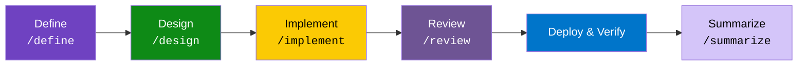

# Directives

**Directives** are written instructions AI agents follow to do real work with real review — the playbook for running a team of AI agents the way you'd run a team of people: defined roles, a staged process, and independent review before anything ships.

Two things to know before anything else:

- **Nothing here installs or runs.** This repo is instructions — markdown and config files your AI tools read. No packages, no build step. (The one exception is a maintainer script under [`scripts/`](scripts/README.md) that adopters never touch.)
- **Who this is for:** a **founder or exec** evaluating the idea → read [Why This Architecture?](docs/why.md). An **engineer or PM** adopting it → go to [Getting Started](docs/getting-started.md). An **AI agent** told to follow the directives → start at [`agents.yml`](agents.yml) and [`framework/`](framework/README.md).

The system is team-agnostic. Engineering is the first fully-built team, but the same scaffolding works for sales, marketing, operations — any team whose work benefits from structured review. Content is licensed [CC BY 4.0](LICENSE) — reuse it for your own company, with attribution.

---

## Problems This Solves

| Problem | How Directives addresses it |
|---------|----------------------------|
| **AI agents skip steps under pressure** | A [pipeline](docs/glossary.md) defines every stage from requirements to delivery. GitHub labels track progress, and your AI warns you before skipping a stage. |
| **Generic AI feedback is shallow** | [Personas](docs/glossary.md) (detailed character profiles — backstory, expertise, review lens) produce targeted, deep feedback instead of "looks good, maybe add some checks." |
| **One agent reviews its own work** | The architecture separates builder and validator [agent types](docs/glossary.md). Different agents — or isolated sessions — catch different blind spots. |
| **Process lives in tribal knowledge** | [Manifests](docs/glossary.md) — plain config files — are the single source of truth for teams, roles, stages, and vocabularies. Version-controlled, no drift. |
| **Setting up takes too long** | Three adoption levels. Use personas alone in 15 minutes. Add the pipeline in 30. Split agents when you're ready. |

## Where to Start

| Level | What you get | Time |
|-------|-------------|------|
| **Quick start** | Better AI reviews using persona definitions — zero config | 15 min |
| **Standard** | Structured pipeline with labels, stage gates, and ready-made [slash commands](docs/commands.md) | 30 min |
| **Full system** | Builder/validator split across two AI providers for independent review | 1 hour |

Each level builds on the last — [Getting Started](docs/getting-started.md) walks all three.

| Doc | What you'll learn | Time |
|-----|-------------------|------|
| [**Why This Architecture?**](docs/why.md) | The business case — the problems and the thinking behind each decision | 10 min |
| [**Key Concepts**](docs/concepts.md) | The mechanics — agent types, personas, pipeline, committee, manifests | 10 min |
| [**Cost & Requirements**](docs/cost-and-requirements.md) | What it needs and what it costs to run | 5 min |
| [**FAQ**](docs/faq.md) | "Do I need all of this?", "Can I use it without engineers?", and more | 3 min |
| [**Glossary**](docs/glossary.md) | Definitions for every term, core terms first | 3 min |

---

## How It Works

A task flows through six [pipeline](docs/glossary.md) stages. Each stage produces artifacts the next one consumes, and each command is a ready-made prompt file you [install once](docs/commands.md):

```mermaid
graph LR
    A["Define<br/><code>/define</code>"] --> B["Design<br/><code>/design</code>"]
    B --> C["Implement<br/><code>/implement</code>"]
    C --> D["Review<br/><code>/review</code>"]
    D --> E["Deploy & Verify"]
    E --> F["Summarize<br/><code>/summarize</code>"]

    style A fill:#6f42c1,color:#fff
    style B fill:#0e8a16,color:#fff
    style C fill:#fbca04,color:#000
    style D fill:#6e5494,color:#fff
    style E fill:#0075ca,color:#fff
    style F fill:#d4c5f9,color:#000
```

### Personas and the committee

A **[committee](docs/glossary.md)** of [personas](docs/glossary.md) — specialists with distinct professional backgrounds — reviews work at the Design and Review stages. Each persona reads all prior feedback before adding their own, building cumulative insight rather than repeating observations.

The engineering team has 11 personas ([full profiles](teams/engineering/personas/README.md)):

| Persona | Focus |
|---------|-------|
| UX Designer | Accessibility, design systems |
| Software Engineer | Code quality, patterns |
| System Architect | Coupling, scalability |
| Data Engineer | Migrations, query performance |
| AI/ML Engineer | LLM safety, prompt risks |
| Security Engineer | Vulnerabilities, auth bypass |
| QA Engineer | Test coverage, edge cases |
| SRE | Ops, health checks, logging |
| Writer | User-facing copy, docs |
| Engineering Manager | Synthesizes all feedback |
| PM | Requirements, scope, PRDs (pipeline only — not a code reviewer) |

Other teams define their own personas and review sequences — the structure is identical, only the expertise changes.

### Builder and validator

The architecture separates work into two [agent types](docs/glossary.md): a **builder** (creates work) and a **validator** (reviews it independently). When backed by different AI providers, they bring different training and biases, catching things the other misses. Even with a single provider, isolated sessions prevent the validator from inheriting the builder's blind spots.

---

## Reference

### Architecture

Three config files drive the system at different scopes:

| File | Scope | What it controls |
|------|-------|-----------------|
| [`agents.yml`](agents.yml) | Global | Agent types, AI providers, assignments, fallback order |
| [`manifest.yml`](teams/engineering/manifest.yml) | Per-team | Role roster, pipeline stages, labels, vocabularies |
| `CONTRIBUTING.md` | Per-project | Team reference, pipeline mode, provider overrides |

(A fourth file, [`projects.yml`](projects.yml), configures this repo's own [maintenance automation](scripts/README.md) — adopters can ignore it.)

### Teams

Each team gets its own [manifest](docs/glossary.md), personas, pipeline, and vocabulary — see the [teams index](teams/README.md). Engineering is the complete worked example: [team overview](teams/engineering/README.md), [personas](teams/engineering/personas/README.md), [process docs](teams/engineering/process/README.md). To create a new team, copy [`teams/new-team-template/`](teams/new-team-template/manifest.yml).

### Global framework

Cross-team rules for how agents think and coordinate — see the [framework index](framework/README.md). Highlights: [verification](framework/verification.md) (how to know work actually works), [controls & detectors](framework/controls-and-detectors.md) (every check must be able to fail), [diagnosis](framework/diagnosis.md) (no theorizing without a reproduction), [safety](framework/safety.md).

### Templates and commands

Starter files you copy into your project — see the [templates index](templates/README.md), including the five ready-made [slash commands](docs/commands.md).

### Provider configs

Which AI providers exist and which backs each agent type is defined in [`agents.yml`](agents.yml). Per-provider setup lives in [`providers/`](providers/antigravity/README.md) — currently a worked example for Antigravity CLI, the default validator. Adding your own provider follows the same shape.

### Domain overlays

Optional domain-specific rules layered on top of the base process. Currently available: [healthcare](overlays/healthcare/README.md) (HIPAA, PHI handling).

### Three-tier model

Configuration lives at three levels, each adding specificity without duplicating the tier above:

| Tier | Where | What |
|------|-------|------|
| **1. Directives** (this repo) | `suniljames/directives` | Team scaffolding, personas, framework, templates |
| **2. Organization** (optional) | `<org>/.github` or org-level repo | Domain compliance, org-specific workflows, shared CI |
| **3. Project** | Each project repo | Tech stack, architecture, environment config |
