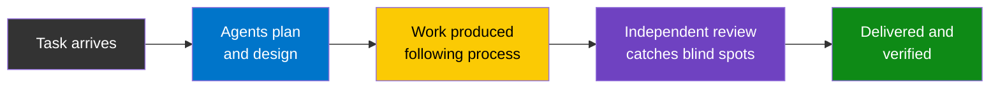
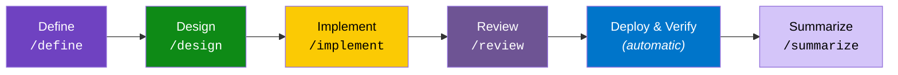
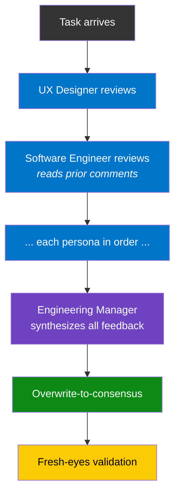

# Key Concepts

Plain-language guide to every idea in this system. Read this first if you're new.

---

## The Core Idea

*Define how work gets done. Make it repeatable. Let the structure scale with you.*

Most AI setups are ad-hoc: you prompt a model, get output, and hope for the best. This system replaces that with a defined process — **[agent types](glossary.md)** that separate creation from review, **[personas](glossary.md)** that shape how each agent thinks, and a **[pipeline](glossary.md)** that prevents skipping steps. Everything is configured through **[manifests](glossary.md)** (YAML files), so changes happen in one place and cascade everywhere.

The pattern works for any team — engineering, sales, marketing, operations — not just software. You define the roles, the stages, and the vocabulary. The system provides the scaffolding.



---

## Agent Types

An **[agent type](glossary.md)** describes *what kind of work* gets done — not *which AI model* does it. There are two types:

| Type | What it does |
|------|-------------|
| **Builder** | Writes code, runs tests, deploys, merges PRs |
| **Validator** | Reviews code, audits security, writes specs, files issues |

**Key insight:** the model that *builds* should not be the same model that *validates*. When one agent does both, its blind spots repeat in every phase — it reviews work it created and misses the same things twice.

| Single agent | Two agent types |
|---|---|
| Reviews its own work | A different agent reviews |
| Same blind spots in both tasks | Independent perspectives catch more |
| "Looks good to me" | "Wait, did you consider...?" |

### Provider assignment

Agent types are backed by **LLM providers** (the AI tools that do the work — Claude Code, Gemini CLI, etc.). The mapping lives in [`agents.yml`](../agents.yml):

```yaml
# Default: Claude builds, Gemini validates
assignments:
  default:
    builder: claude-code
    validator: gemini-cli
```

If a provider isn't available, the system falls back — even running both types on the same provider in **isolated sessions** so they can't share context. Not as good as two different models, but significantly better than one session doing both.

---

## Personas

*A panel of specialists, each with their own lens.*

A **[persona](glossary.md)** is a character profile that shapes how an AI agent approaches work. Each persona has a title, backstory, expertise, and review focus. The backstory isn't decoration — it anchors the agent's decision-making by giving it a professional context to reason from.

The engineering team has 11 personas. Each sees problems differently:

| Persona | Focus |
|---|---|
| **UX Designer** | Accessibility, design systems, responsive behavior |
| **Software Engineer** | Code quality, patterns, readability |
| **System Architect** | Service boundaries, coupling, scalability |
| **Data Engineer** | Schema design, migrations, query performance |
| **AI/ML Engineer** | LLM integration, prompt safety, cost |
| **Security Engineer** | Vulnerabilities, auth, data exposure |
| **QA Engineer** | Test coverage, edge cases, test layers |
| **SRE** | Reliability, logging, health checks |
| **Writer** | User-facing copy, error messages, docs |
| **Engineering Manager** | Synthesizes all feedback, makes final calls |
| **PM** | Requirements, acceptance criteria, user value |

### Why personas matter

Without a persona, AI feedback is generic: *"Consider adding error handling."*

With the **Security Engineer** persona: *"MUST-FIX: This endpoint accepts user input without validation — an attacker could inject SQL via the `name` parameter."*

The difference is depth. A persona doesn't just tell the agent *what* to look for — it gives the agent a professional identity that shapes *how* it thinks about the problem.

**Beyond engineering:** A sales team might use Deal Strategist, Pricing Analyst, Legal Reviewer, and VP of Sales. A marketing team might use Brand Strategist, SEO Specialist, and Copy Editor. The structure is identical — only the expertise changes.

### Cross-cutting traits

All personas on a team share a common culture defined in [`cross-cutting-traits.md`](../teams/engineering/personas/cross-cutting-traits.md). For the engineering team, these include values like radical pragmatism, test-first thinking, and ops ownership. This ensures consistency across personas while allowing each to bring their specialized lens.

---

## The Pipeline

*An assembly line. Each station checks the last.*

A **[pipeline](glossary.md)** takes a task from start to finish through a defined sequence of stages. Each stage produces artifacts the next one consumes, and GitHub labels track which stages are complete.



| Stage | What happens | Who | Label |
|---|---|---|---|
| Define | PM writes a PRD with acceptance criteria | Validator | `pm-reviewed` |
| Design | Committee reviews feasibility, architecture, UX, security | Both | `design-complete` |
| Implement | TDD: failing tests → implement → green → refactor | Builder | `implementing` |
| Review | Up to 3 rounds of committee code review, then squash merge | Both | `merged` |
| Deploy & Verify | Rebuild, health check, close issue (automatic) | Builder | Issue closed |
| Summarize | Stakeholder summary of what shipped and why | Validator | `summarized` |

The pipeline is advisory, not a hard block. If you skip a stage, the system warns you and asks for confirmation — but it won't prevent you. Hotfixes happen, and the process should support them rather than getting in the way.

### Pipeline modes

Projects declare a mode in their `CONTRIBUTING.md` to control how much human involvement is required:

| Mode | Behavior |
|---|---|
| **Autonomous** | Runs end-to-end without human gates |
| **Gated** | Pauses after Design and Review for human approval |

---

## The Committee

*Each reviewer reads all prior feedback first.*

A **[committee](glossary.md)** is the full team of personas reviewing work in sequence. It's not a meeting — it's a structured protocol designed to build cumulative insight. Each persona reads everything that came before, so later reviewers can build on (or challenge) earlier observations rather than duplicating them.



### Key rules

1. **Sequential posting** — Each persona reads *all* prior comments first. No parallel reviews. This prevents redundant observations and lets later reviewers address gaps the earlier ones missed.
2. **[Overwrite-to-consensus](glossary.md)** — After the Engineering Manager synthesizes all feedback, members whose positions changed edit their original comments to show their final stance. Readers see clean conclusions, not a debate thread they have to interpret.
3. **[Fresh-eyes validation](glossary.md)** — A zero-context sub-agent reads only the final spec and flags anything ambiguous. This catches assumptions the committee built during discussion but forgot to write down — the "curse of knowledge" problem.

---

## Manifests

*One file to rule them all.*

A **[manifest](glossary.md)** is a YAML file that serves as the single source of truth for a team's configuration: who's on the team, what the pipeline looks like, and what vocabulary they use. When the manifest changes, the change cascades everywhere — no drift between docs and config.

```yaml
# teams/engineering/manifest.yml (simplified)
team: engineering

roles:
  - id: ux-designer
    name: UX Designer
    agent: builder           # which agent type
    persona: personas/ux-designer.md
    review_order: 1          # position in committee sequence

pipeline:
  - stage: pm-review
    command: /define
    agent: validator
    label:
      name: pm-reviewed

vocabularies:
  severity_levels:
    - id: must-fix
      blocks: merge
```

Add a persona → one manifest entry. Change review order → edit one number. Swap LLM provider → update one line. Add a team → copy `teams/TEMPLATE/` and fill in roles.

Every team gets its own manifest. A sales team would define different roles, stages, and vocabularies — but the structure is the same.

---

## Severity Levels

Review findings use a shared [severity vocabulary](glossary.md) so there's no ambiguity about what blocks progress:

| Severity | Meaning | Blocks? |
|---|---|---|
| **MUST-FIX** | Correctness bug, security vulnerability, data loss risk | Merge |
| **SHOULD-FIX** | Code quality issue, missing edge case, poor naming | Current round |
| **NIT** | Style preference, minor suggestion | Nothing |

---

## The Three-Tier Model

Configuration lives at three levels. Each adds specificity without duplicating the tier above. See [glossary](glossary.md).

| Tier | Where | What |
|------|-------|------|
| **1. Directives** (this repo) | `suniljames/directives` | Team scaffolding, personas, framework, templates |
| **2. Organization** (optional) | `<org>/.github` or org-level repo | Domain compliance, org-specific workflows, shared CI |
| **3. Project** | Each project repo | Tech stack, architecture, environment config |

The directives repo provides the *what* and *why*. The project repo provides the *how* and *where*. The organization tier is optional — useful when multiple projects share domain-specific requirements (like HIPAA compliance) but not needed for most setups.

---

## Domain Overlays

An **[overlay](glossary.md)** adds domain-specific rules (HIPAA, PCI, etc.) on top of the base process. Overlays are additive — they extend the base, never replace it. This keeps domain compliance cleanly separated from team fundamentals.

---

## Next Steps

- [Why This Architecture?](why.md) — The philosophy behind these decisions
- [Getting Started](getting-started.md) — Set this up in your own project
- [Glossary](glossary.md) — Quick reference for all terms
