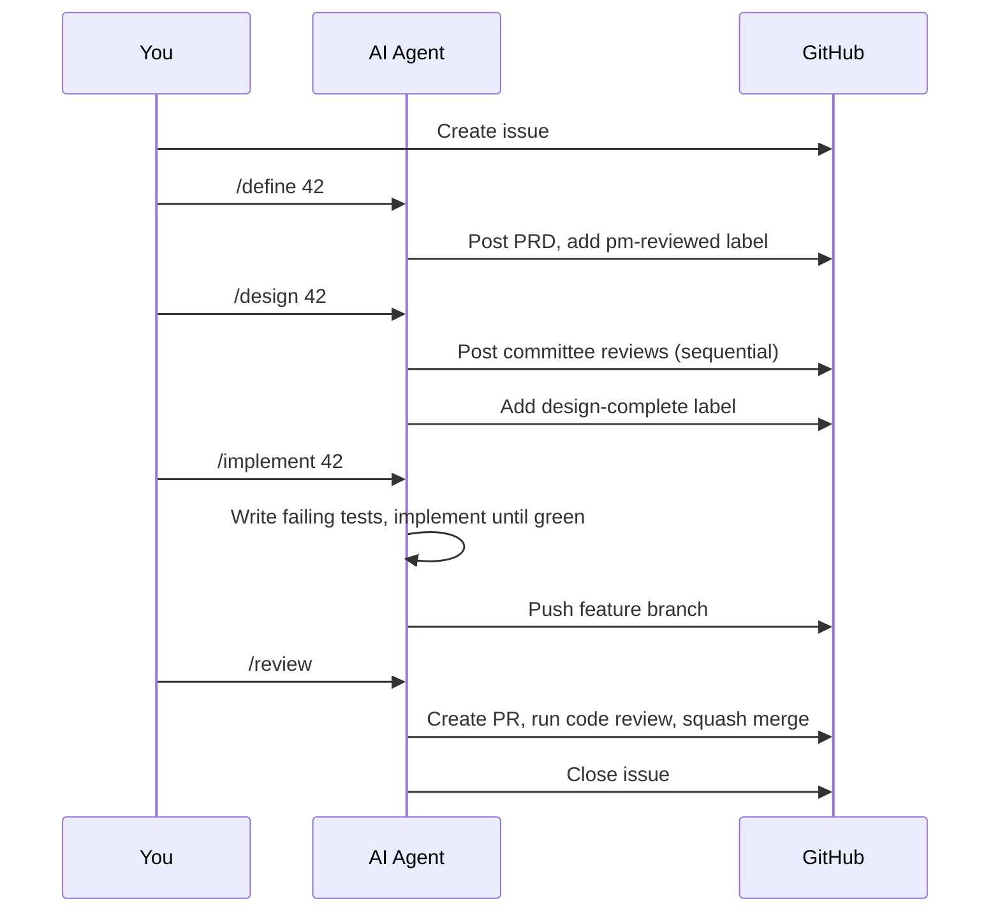

# Getting Started

Set up this system in your project. You can adopt the full [pipeline](glossary.md) or start with just the pieces that help most — each level builds on the last, so you're never locked into a decision.

---

## Prerequisites

- A GitHub repository
- At least one AI tool (Claude Code, Gemini CLI, Cursor, ChatGPT, etc.)
- Familiarity with the [key concepts](concepts.md)

---

## Adoption Levels

Pick the level that fits your needs right now. You can move up later without reworking what you've already done.

| Level | What you get | Time |
|-------|-------------|------|
| **Quick start** | Better AI reviews using persona definitions — zero config files | 15 min |
| **Standard** | Structured pipeline with labels, stage gates, and repeatable process | 30 min |
| **Full system** | Builder/validator split across different LLM providers (the AI tools that do the work) for independent review | 1 hour |

---

## Quick Start: Persona-Driven Reviews (15 minutes)

Use [persona](glossary.md) definitions to improve AI reviews. No config files, no pipeline, no multi-agent setup — just better prompts that produce deeper feedback.

### Pick your personas

Browse [`teams/engineering/personas/`](../teams/engineering/personas/). You don't need all 11. Match your biggest gaps:

| Worried about... | Use |
|---|---|
| Accessibility, design | UX Designer |
| Code quality, patterns | Software Engineer |
| Architecture, coupling | System Architect |
| Database, migrations | Data Engineer |
| AI/LLM integration | AI/ML Engineer |
| Security vulnerabilities | Security Engineer |
| Test coverage, edge cases | QA Engineer |
| Operational reliability | SRE |
| User-facing copy, docs | Writer |

### Use them in your prompts

Copy-paste this into your AI tool:

```
Review this PR as the Security Engineer described in:
https://github.com/suniljames/directives/blob/main/teams/engineering/personas/security-engineer.md

Categorize findings as MUST-FIX, SHOULD-FIX, or NIT.
```

**Expected output:** Instead of *"Looks good, maybe add some tests"*, you'll get targeted findings like *"MUST-FIX: This endpoint accepts user input at line 47 without sanitization. SQL injection via the `name` parameter."*

That's it — you're already getting deeper reviews. The persona file gives the AI a professional identity to reason from, which changes the quality of its feedback dramatically.

---

## Standard: Pipeline + Personas (30 minutes)

Add the structured workflow on top of persona-driven reviews: labels track progress, stage gates prevent skipping steps, and the process becomes repeatable across projects.

### 1. Copy the templates

```bash
cp templates/CONTRIBUTING.md.template  your-project/CONTRIBUTING.md
cp templates/CLAUDE.md.template        your-project/CLAUDE.md
```

### 2. Set your pipeline mode

Edit `CONTRIBUTING.md` to declare which team this project belongs to and how much human involvement the pipeline requires:

```markdown
<!-- team: engineering -->
<!-- pipeline-mode: autonomous -->
```

| Mode | Behavior |
|------|----------|
| **autonomous** | AI runs the full pipeline without stopping |
| **gated** | AI pauses after Design and Review for your approval |

### 3. Fill in project-specific sections

Templates have `TODO` markers for your tech stack, dev environment, and project docs. Fill these in so the AI has the context it needs to work effectively in your project.

### 4. Create slash commands

Each pipeline stage maps to a slash command. Create these files in your project:

```
.claude/commands/
  define.md     # /define — Define requirements (PRD)
  design.md     # /design — Committee design review
  implement.md  # /implement — TDD implementation
  review.md     # /review — Code review & merge
  summarize.md  # /summarize — Stakeholder summary
```

See [pipeline docs](../teams/engineering/process/pipeline.md) for what each stage produces and the artifacts that flow between them.

### 5. Set up labels

The pipeline uses GitHub labels to track which stages are complete. Create them once per repository:

```bash
gh label create "pm-reviewed"     --color "6f42c1" --repo your-org/your-repo
gh label create "design-complete" --color "0e8a16" --repo your-org/your-repo
gh label create "implementing"    --color "fbca04" --repo your-org/your-repo
gh label create "merged"          --color "6e5494" --repo your-org/your-repo
gh label create "summarized"      --color "d4c5f9" --repo your-org/your-repo
gh label create "ai:autonomous"   --color "1d76db" --repo your-org/your-repo
```

### What the flow looks like



---

## Full System: Multi-Agent Setup (1 hour)

Split [builder and validator](glossary.md) across different LLM providers for genuinely independent reviews. This is the highest-quality configuration — different models with different training catch different things.

### 1. Configure agents.yml

The default [`agents.yml`](../agents.yml) maps Claude Code as builder, Gemini CLI as validator. Adjust for your providers:

```yaml
assignments:
  default:
    builder: claude-code      # Your primary coding AI
    validator: gemini-cli     # Your review/audit AI
```

### 2. Add validator agent config

Create `GEMINI.md` (or equivalent) in your project. This file primes the validator so it knows its role:

```markdown
# Validator Agent Config

You are the **validator** agent. You did NOT build this code.
Review independently using the personas assigned to you.

Refer to the [engineering directives](https://github.com/suniljames/directives)
for persona definitions and review process.
```

### 3. Assign roles to agent types

The [manifest](glossary.md) already does this — each role has an `agent:` field that determines which agent type runs it:

```yaml
roles:
  - id: security-engineer
    agent: validator        # Runs on the validator (Gemini)
  - id: software-engineer
    agent: builder          # Runs on the builder (Claude)
```

### 4. Single-provider fallback

Only one AI tool? You can still get most of the benefit by running both agent types in **separate sessions**:

```
Session 1 (Builder):
  "You are the builder agent. Implement the feature."

Session 2 (Validator — separate conversation):
  "You are the validator agent. You did NOT build this code.
   Review it independently."
```

The key: **never share conversation history** between sessions. The validator's value comes from having no memory of the builder's reasoning — it can't inherit assumptions it never saw.

---

## Customizing Personas

**Add a persona:** Create `teams/engineering/personas/your-role.md` following the [template](../teams/TEMPLATE/personas/example-role.md), then add the role to `manifest.yml`. The template includes all the fields the system expects: backstory, expertise, review lens, and interaction style.

**Change review order:** Edit `review_order` in the manifest. The order matters because each persona reads all prior feedback — later reviewers build on earlier observations. Engineering Manager is always last (`review_order: last`) because they synthesize everything.

**Create a new team:** Copy `teams/TEMPLATE/` → `teams/your-team/`. See the [template manifest](../teams/TEMPLATE/manifest.yml) for field docs.

---

## Beyond Engineering

The system is team-agnostic — engineering is the first fully-built team, but the same structure works for any team that benefits from structured review. To create a non-engineering team:

1. **Copy the template:** `cp -r teams/TEMPLATE teams/sales`
2. **Define personas:** What roles review work on your team?

   | Role | Focus |
   |---|---|
   | Deal Strategist | Win probability, positioning, account fit |
   | Pricing Analyst | Margins, discounts, deal structure |
   | Legal Reviewer | Contract terms, compliance, risk |
   | VP of Sales | Strategic alignment, forecast impact |

3. **Define pipeline stages:** What does work flow through? A sales team might use Qualify → Propose → Review → Close instead of Define → Design → Implement → Review.
4. **Define vocabularies:** What severity levels and categories apply?

Agent types, manifest structure, pipeline mechanics, and committee protocol all transfer directly. Only the personas, stages, and vocabulary change.

---

## Adding Domain Overlays

Domain-specific requirements (healthcare, fintech) can be layered on top of the base process using [overlays](glossary.md):

```
overlays/
  healthcare/        # HIPAA, PHI handling, patient safety
  your-domain/       # Your domain-specific rules
```

Overlays are additive — they extend the base process, never replace it. Reference them from your `CONTRIBUTING.md`.

---

## Project Structure After Setup

```
your-project/
  CONTRIBUTING.md           # Team, pipeline mode, tech stack
  CLAUDE.md                 # Builder agent config
  GEMINI.md                 # Validator agent config (optional)
  .claude/
    commands/
      define.md             # /define command
      design.md             # /design command
      implement.md          # /implement command
      review.md             # /review command
      summarize.md          # /summarize command
  docs/
    developer/
      code-review-lenses.md # Tech-specific review checklists
      project-context.md    # Project-specific persona knowledge
```

Link to directives, don't copy. Your project references the persona files and process docs in this repo — that way updates flow automatically.

---

## Troubleshooting

**"My AI doesn't follow the persona well"** — Provide the full persona file, not just the role name. The backstory and interaction style are what anchor the AI's decisions — without them, you're just asking for a generic review.

**"The pipeline feels heavy for small changes"** — Use the ad-hoc work gate. The pipeline warns when you skip stages but doesn't block you. For quick fixes, skip straight to implementation — you'll be asked to confirm, and a note is added to the PR.

**"I only have one AI tool"** — See [single-provider fallback](#4-single-provider-fallback) above. Quick start persona reviews work with any single tool, and even the Standard level works fine with one provider.

---

## Next Steps

- [Key Concepts](concepts.md) — Reference for all terminology
- [Why This Architecture?](why.md) — Philosophy behind these decisions
- [Glossary](glossary.md) — Definitions for every term
- [Pipeline details](../teams/engineering/process/pipeline.md) — Deep dive into each stage
- [Committee process](../teams/engineering/process/committee-process.md) — How the review protocol works
