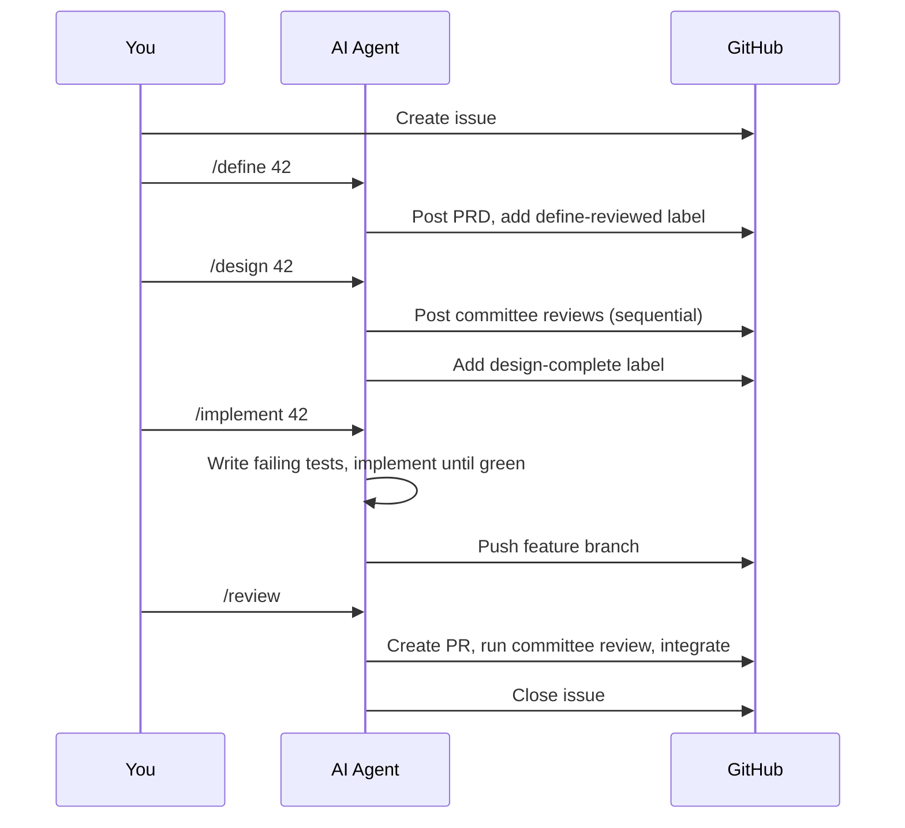

# Getting Started

Set up this system in your project. You can adopt the full [pipeline](glossary.md) or start with just the pieces that help most — each level builds on the last, so you're never locked into a decision.

**Contents:** [Prerequisites](#prerequisites) · [Quick Start (15 min)](#quick-start-persona-driven-reviews-15-minutes) · [Standard (30 min)](#standard-pipeline--personas-30-minutes) · [Full System (1 hr)](#full-system-multi-agent-setup-1-hour) · [Customizing](#customizing-personas) · [Other teams](#beyond-engineering) · [Overlays](#adding-domain-overlays) · [Troubleshooting](#troubleshooting)

---

## Prerequisites

- A GitHub repository, and an account that can create labels on it
- At least one AI tool (Claude Code, Antigravity CLI, Cursor, ChatGPT, etc.)
- The [`gh` command-line tool](https://cli.github.com) (used once, for label setup in the Standard path)
- A local copy of this repo to copy templates from: `git clone https://github.com/suniljames/directives`
- Familiarity with the [key concepts](concepts.md)

**Link or fork?** Decide once, up front. **Link** (the default): your project references persona and process files in this repo by URL, so improvements flow to you automatically. **Fork**: copy the repo into your org when you want to customize personas, teams, or process — your fork becomes your source of truth. Everything below works identically either way.

---

## Adoption Levels

Pick the level that fits your needs right now. You can move up later without reworking what you've already done.

| Level | What you get | Time |
|-------|-------------|------|
| **Quick start** | Better AI reviews using persona definitions — zero config files | 15 min |
| **Standard** | Structured pipeline with labels, stage gates, and repeatable process | 30 min |
| **Full system** | Builder/validator split across different LLM providers (the AI tools that do the work) for independent review | 1 hour |

---

## Quick Start: Persona-Driven Reviews (15 minutes)

Use [persona](glossary.md) definitions to improve AI reviews. No config files, no pipeline, no multi-agent setup — just better prompts that produce deeper feedback.

### Pick your personas

Browse the [persona index](../teams/engineering/personas/README.md). You don't need all 11 — the nine below are the review lenses; the other two (Engineering Manager, PM) run the pipeline rather than review work. Match your biggest gaps:

| Worried about... | Use |
|---|---|
| Accessibility, design | UX Designer |
| Code quality, patterns | Software Engineer |
| Architecture, coupling | System Architect |
| Database, migrations | Data Engineer |
| AI/LLM integration | AI/ML Engineer |
| Security vulnerabilities | Security Engineer |
| Test coverage, edge cases | QA Engineer |
| Operational reliability | SRE |
| User-facing copy, docs | Writer |

### Use them in your prompts

Paste the **full text of the persona file** into your AI tool along with the request (if your tool can fetch URLs, the link alone works too):

```
Review this PR as the Security Engineer described below.
Categorize findings as MUST-FIX, SHOULD-FIX, or NIT.

[paste the contents of teams/engineering/personas/security-engineer.md here]
```

**Expected output:** Instead of *"Looks good, maybe add some tests"*, you'll get targeted findings like *"MUST-FIX: This endpoint accepts user input at line 47 without sanitization. SQL injection via the `name` parameter."*

That's it — you're already getting deeper reviews.

---

## Standard: Pipeline + Personas (30 minutes)

Add the structured workflow on top of persona-driven reviews: labels track progress, stage gates prevent skipping steps, and the process becomes repeatable across projects.

### 1. Copy the templates

```bash
cp templates/CONTRIBUTING.md.template  your-project/CONTRIBUTING.md
cp templates/CLAUDE.md.template        your-project/CLAUDE.md
```

### 2. Set your pipeline mode

Edit `CONTRIBUTING.md` to declare which team this project belongs to and how much human involvement the pipeline requires:

```markdown
<!-- team: engineering -->
<!-- pipeline-mode: autonomous -->
```

| Mode | Behavior |
|------|----------|
| **autonomous** | AI runs the full pipeline without stopping |
| **gated** | AI pauses after Design and Review for your approval |

### 3. Fill in project-specific sections

Templates have `TODO` markers for your tech stack, dev environment, and project docs. Fill these in so the AI has the context it needs to work effectively in your project.

### 4. Install the slash commands

Each pipeline stage maps to a slash command — a saved prompt file your AI tool loads. **Ready-made starters ship in this repo**; copy all five (example path shown for Claude Code, adjust for your tool):

```bash
cp templates/commands/{define,design,implement,review,summarize}.md  your-project/.claude/commands/
```

Then open your copy of `implement.md` and fill in the one marked slot: your project's quality-gate command. What each command does and how to customize: [Commands](commands.md). What each stage produces: [pipeline docs](../teams/engineering/process/pipeline.md).

### 5. Set up labels

The pipeline uses GitHub labels to track which stages are complete. Names and colors come from the [manifest](../teams/engineering/manifest.yml); create them once per repository:

```bash
gh label create "define-reviewed" --color "6f42c1" --repo your-org/your-repo
gh label create "design-complete" --color "0e8a16" --repo your-org/your-repo
gh label create "implementing"    --color "fbca04" --repo your-org/your-repo
gh label create "merged"          --color "6e5494" --repo your-org/your-repo
gh label create "summarized"      --color "d4c5f9" --repo your-org/your-repo
```

### What the flow looks like


```mermaid
sequenceDiagram
    participant You
    participant AI as AI Agent
    participant GH as GitHub

    You->>GH: Create issue
    You->>AI: /define 42
    AI->>GH: Post PRD, add define-reviewed label
    You->>AI: /design 42
    AI->>GH: Post committee reviews (sequential)
    AI->>GH: Add design-complete label
    You->>AI: /implement 42
    AI->>AI: Write failing tests, implement until green
    AI->>GH: Push feature branch
    You->>AI: /review
    AI->>GH: Create PR, run committee review, integrate
    AI->>GH: Close issue
```

---

## Full System: Multi-Agent Setup (1 hour)

Split [builder and validator](glossary.md) across different LLM providers for genuinely independent reviews. This is the highest-quality configuration — different models with different training catch different things.

### 1. Configure agents.yml

The default [`agents.yml`](../agents.yml) maps Claude Code as builder, Antigravity CLI as validator. Adjust for your providers:

```yaml
assignments:
  default:
    builder: claude-code         # Your primary coding AI
    validator: antigravity-cli   # Your review/audit AI
```

### 2. Add validator agent config

Create the validator provider's context file in your project (each provider reads its own root config — example: `GEMINI.md` for Gemini CLI). This file primes the validator so it knows its role, pipeline commands, and session isolation rules.

For the full 5-section reference template (Antigravity example): [`providers/antigravity/GEMINI-template.md`](../providers/antigravity/GEMINI-template.md)
For a minimal starter: [`templates/GEMINI.md.template`](../templates/GEMINI.md.template)

The full template covers:
- GitHub identity and credential safety rules
- Pipeline command mapping (your stage → the validator's responsibility)
- Session isolation (why the validator must start fresh, not inherit builder context)
- Validator role declaration (maps back to `agents.yml` — the template doesn't redefine the role)
- Explicit no-credentials section

### 3. Assign roles to agent types

The [manifest](glossary.md) already does this — each role has an `agent:` field that determines which agent type runs it:

```yaml
roles:
  - id: security-engineer
    agent: validator        # Runs on the validator (Antigravity)
  - id: software-engineer
    agent: builder          # Runs on the builder (Claude)...
    stages:
      review-merge: validator   # ...but reviews as validator at the Review stage
```

### 4. Single-provider fallback

Only one AI tool? You can still get most of the benefit by running both agent types in **separate sessions**:

```
Session 1 (Builder):
  "You are the builder agent. Implement the feature."

Session 2 (Validator — separate conversation):
  "You are the validator agent. You did NOT create this work.
   Review it independently."
```

The key: **never share conversation history** between sessions. The validator's value comes from having no memory of the builder's reasoning — it can't inherit assumptions it never saw.

---

## Customizing Personas

**Add a persona:** In your fork, create `teams/engineering/personas/your-role.md` following the [template](../teams/new-team-template/personas/example-role.md), then add the role to `manifest.yml`. (Customizing personas requires the fork path — see Prerequisites. Improvements that are generic are welcome upstream too.) The template includes all the fields the system expects: backstory, expertise, review lens, and interaction style.

**Change review order:** Edit `review_order` in the manifest. The order matters because each persona reads all prior feedback — later reviewers build on earlier observations. Engineering Manager is always last (`review_order: last`) because they synthesize everything.

**Create a new team:** Copy `teams/new-team-template/` → `teams/your-team/`. See the [template manifest](../teams/new-team-template/manifest.yml) for field docs.

---

## Beyond Engineering

The system is team-agnostic — engineering is the first fully-built team, but the same structure works for any team that benefits from structured review. To create a non-engineering team:

1. **Copy the template:** `cp -r teams/new-team-template teams/sales`
2. **Define personas:** What roles review work on your team?

   | Role | Focus |
   |---|---|
   | Deal Strategist | Win probability, positioning, account fit |
   | Pricing Analyst | Margins, discounts, deal structure |
   | Legal Reviewer | Contract terms, compliance, risk |
   | VP of Sales | Strategic alignment, forecast impact |

3. **Define pipeline stages:** What does work flow through? A sales team might use Qualify → Propose → Review → Close instead of Define → Design → Implement → Review.
4. **Define vocabularies:** What severity levels and categories apply?

Agent types, manifest structure, pipeline mechanics, and committee protocol all transfer directly. Only the personas, stages, and vocabulary change.

---

## Adding Domain Overlays

Domain-specific requirements (healthcare, fintech) can be layered on top of the base process using [overlays](glossary.md):

```
overlays/
  healthcare/        # HIPAA, PHI handling
  your-domain/       # Your domain-specific rules
```

Overlays are additive — they extend the base process, never replace it. Reference them from your `CONTRIBUTING.md`.

---

## Project Structure After Setup

```
your-project/
  CONTRIBUTING.md           # Team, pipeline mode, tech stack
  CLAUDE.md                 # Builder agent config
  GEMINI.md                 # Validator provider's context file (optional; name per provider)
  .claude/
    commands/
      define.md             # /define command
      design.md             # /design command
      implement.md          # /implement command
      review.md             # /review command
      summarize.md          # /summarize command
  docs/
    developer/
      code-review-lenses.md # Domain-specific review checklists
      project-context.md    # Project-specific persona knowledge
```

On the link path (see Prerequisites), your project references the persona files and process docs in this repo by URL — updates flow automatically. On the fork path, the references point at your fork instead.

---

## Troubleshooting

**"My AI doesn't follow the persona well"** — Provide the full persona file, not just the role name. The backstory and interaction style are what anchor the AI's decisions — without them, you're just asking for a generic review.

**"The pipeline feels heavy for small changes"** — Skip stages deliberately. The [ad-hoc work gate](../teams/engineering/process/pipeline.md#ad-hoc-work-gate) warns when lifecycle labels are missing but doesn't block: for quick fixes, go straight to implementation, confirm the warning, and a note lands in the PR description.

**"I only have one AI tool"** — See [single-provider fallback](#4-single-provider-fallback) above. Quick start persona reviews work with any single tool, and even the Standard level works fine with one provider.

---

## Next Steps

- [Commands](commands.md) — What the slash commands are and how to customize them
- [Cost & Requirements](cost-and-requirements.md) — What running the pipeline costs
- [Key Concepts](concepts.md) — Reference for all terminology
- [Why This Architecture?](why.md) — The business case behind these decisions
- [Glossary](glossary.md) — Definitions for every term
- [Pipeline details](../teams/engineering/process/pipeline.md) — Deep dive into each stage
- [Committee process](../teams/engineering/process/committee-process.md) — How the review protocol works
- [Acceptance & the close gate](../teams/engineering/process/acceptance-and-close.md) — How "done" is decided and verified
- [Fan-out safety](../framework/fan-out-safety.md) — Spawning parallel sub-agents without injection or authority leaks
- [CLAUDE.md Authoring Guide](claude-md-authoring.md) — How to write thin root configs with progressive disclosure
- [Provider config example (Gemini)](../providers/gemini/GEMINI-template.md) — Full reference template for validator agent setup
