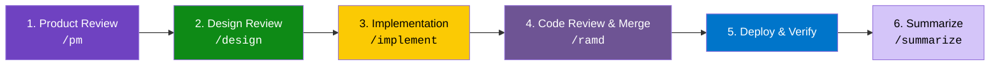

# Key Concepts

A plain-language guide to the ideas behind this system. Read this first if you're new.

---

## The Core Idea

Most AI agent setups use a single model for everything: creating work, reviewing it, and shipping it. This is like having the same person build a bridge and inspect it — they'll miss the same things both times.

This system fixes that by splitting the work across **agent types**, giving each agent **personas** that shape how it thinks, and connecting everything through a **pipeline** that ensures nothing gets skipped. The pattern works for any team — engineering, sales, marketing, operations — not just software development.

```
  A task arrives      AI agents review,       Work is produced     Independent agents      Delivered and
  (issue, ticket, --> plan, and design   -->  following the   -->  review the work    -->  verified
   brief, etc.)       the approach            team's process       for blind spots
```

---

## Agent Types

An **agent type** is an abstract role — it describes *what kind of work* gets done, not *which AI model* does it.

```
                    +-----------+
                    | agents.yml |  <-- defines these
                    +-----+-----+
                          |
              +-----------+-----------+
              |                       |
        +-----+------+        +------+-----+
        |   Builder   |        |  Validator  |
        +-----+------+        +------+-----+
              |                       |
     Implements code           Reviews code
     Runs tests                Writes specs
     Deploys                   Audits security
     Merges PRs                Files issues
```

**Builder** and **Validator** are the two agent types. The key insight: the model that *builds* the code should not be the same model that *validates* it.

### Why two agent types?

| Single agent | Two agent types |
|---|---|
| Builds code, then reviews its own work | One builds, a different one reviews |
| Shares blind spots across both tasks | Independent perspectives catch more issues |
| "Looks good to me" (because I wrote it) | "Wait, did you consider...?" |

### Provider assignment

Agent types are backed by **LLM providers** (Claude Code, Gemini CLI, etc.). The mapping is configured in [`agents.yml`](../../agents.yml):

```yaml
# Default: Claude builds, Gemini validates
assignments:
  default:
    builder: claude-code
    validator: gemini-cli
```

If a provider isn't available, the system falls back — even running both agent types on the same provider in **isolated sessions** so they can't share context.

---

## Personas

A **persona** is a detailed character profile that shapes how an AI agent approaches a specific kind of work. Each persona has a title, years of experience, a professional backstory, core expertise, and a defined review focus.

```
                         +------------------+
                         |   Engineering    |
                         |     Team         |
                         +--------+---------+
                                  |
        +-------+-------+--------+--------+-------+-------+
        |       |       |        |        |       |       |
      +---+   +---+   +---+   +----+   +---+   +---+   +---+
      | UX |   | SE |   | SA |   | DE |   |AI/ML|  |SecE|   | QA |  ...
      +---+   +---+   +---+   +----+   +---+   +---+   +---+
```

Each team defines its own personas. The engineering team has 11, each seeing problems through a different lens:

| Persona | What they care about |
|---|---|
| **UX Designer** | Accessibility, design systems, responsive behavior |
| **Software Engineer** | Code quality, patterns, readability |
| **System Architect** | Service boundaries, coupling, scalability |
| **Data Engineer** | Schema design, migrations, query performance |
| **AI/ML Engineer** | LLM integration, prompt safety, cost |
| **Security Engineer** | Vulnerabilities, auth, data exposure |
| **QA Engineer** | Test coverage, edge cases, test layer decisions |
| **SRE** | Reliability, logging, health checks, degradation |
| **Writer** | User-facing copy, error messages, documentation |
| **Engineering Manager** | Synthesizes all feedback, resolves conflicts, makes final calls |
| **PM** | Requirements, acceptance criteria, user value |

### Why personas matter

Without personas, an AI review comment is generic: "Consider adding error handling." With a persona, the **Security Engineer** says: "This endpoint accepts user input without validation — an attacker could inject SQL via the `name` parameter. MUST-FIX." The persona brings *depth* and *specificity* that generic prompting can't match.

The same principle applies beyond engineering. A sales team might have personas like Deal Strategist, Pricing Analyst, Legal Reviewer, and VP of Sales. A marketing team might have Brand Strategist, SEO Specialist, Copy Editor, and Campaign Manager. The structure is identical — only the expertise changes.

### Cross-cutting traits

Beyond individual expertise, all personas share a team culture defined in [`cross-cutting-traits.md`](../../teams/engineering/personas/cross-cutting-traits.md) — values like radical pragmatism, test-first thinking, and "you carry the pager" ops ownership.

---

## The Pipeline

A **pipeline** is a multi-stage workflow that takes a task from start to finish. Each stage produces artifacts the next stage consumes, and GitHub labels track progress. Every team defines its own pipeline stages in its manifest.

The engineering team's pipeline takes a GitHub issue from idea to production:



| Stage | What happens | Who does it | Label applied |
|---|---|---|---|
| Product Review | PM writes a PRD with acceptance criteria | Validator | `pm-reviewed` |
| Design Review | Full committee reviews feasibility, architecture, UX, security | Builder + Validator | `design-complete` |
| Implementation | TDD: write failing tests, implement, get green, refactor | Builder | `implementing` |
| Code Review & Merge | Up to 3 rounds of committee code review, then squash merge | Builder + Validator | `merged` |
| Deploy & Verify | Rebuild, health check, close issue | Builder | Issue closed |
| Summarize | Plain-language summary for stakeholders | Validator | `summarized` |

### Pipeline modes

Projects declare a pipeline mode in their `CONTRIBUTING.md`:

| Mode | Behavior |
|---|---|
| **Autonomous** | Runs end-to-end without human gates. For trusted automation and solo AI work. |
| **Gated** | Pauses after design review and after code review for human authorization. For teams with human contributors. |

---

## The Committee

A **committee** is the full team of personas convening to review a piece of work. It's not a meeting — it's a structured, sequential review protocol. Each team defines its own committee composition and review order in its manifest.

The engineering committee reviews issues and PRs:

```
  Issue arrives
       |
       v
  +--[UX Designer]--+
  |  reviews first   |
  +--------+---------+
           |  reads prior comments
           v
  +--[Software Eng]--+
  |  reviews second   |
  +--------+----------+
           |  reads prior comments
           v
         ...  (each persona in order)
           |
           v
  +--[Writer]--------+
  |  reviews ninth    |
  +--------+----------+
           |
           v
  +--[Eng Manager]---+
  |  synthesizes all  |
  |  makes final call |
  +--------+----------+
           |
           v
  Overwrite-to-consensus
  (members update their
   comments to reflect
   final positions)
           |
           v
  Fresh-eyes validation
  (zero-context sub-agent
   checks for gaps)
```

### Key rules

1. **Sequential posting** — Each persona reads *all* prior comments before posting. No parallel reviews. This builds cumulative insight.
2. **Overwrite-to-consensus** — After the Engineering Manager synthesizes, members whose positions changed edit their original comments. A reader sees clean final positions, not a debate thread.
3. **Fresh-eyes validation** — A separate sub-agent with zero prior context reads the final issue description and flags anything ambiguous. This catches "curse of knowledge" gaps.

---

## Manifests

A **manifest** is a YAML file that serves as the single source of truth for a team's configuration: who's on the team, what the pipeline looks like, and what vocabulary the team uses.

```yaml
# teams/engineering/manifest.yml (simplified)
team: engineering

roles:
  - id: ux-designer
    name: UX Designer
    agent: builder           # <-- which agent type
    persona: personas/ux-designer.md
    review_order: 1          # <-- position in committee sequence

pipeline:
  - stage: pm-review
    command: /pm
    agent: validator
    label:
      name: pm-reviewed
      color: "6f42c1"

vocabularies:
  severity_levels:
    - id: must-fix
      blocks: merge
```

When you change the manifest, the change cascades everywhere — add a new persona, reorder the review sequence, add a pipeline stage, or adjust severity levels in one place.

Every team gets its own manifest. A sales team's manifest would define roles like Account Executive and Deal Desk Analyst, pipeline stages like Qualification and Proposal Review, and vocabularies like deal sizes and win/loss categories. The structure is identical to engineering — only the content differs.

---

## Severity Levels

Review findings are tagged with a severity that determines whether they block progress:

| Severity | Meaning | Blocks? |
|---|---|---|
| **MUST-FIX** | Correctness bug, security vulnerability, data loss risk | Blocks merge |
| **SHOULD-FIX** | Code quality issue, missing edge case, poor naming | Blocks current review round |
| **NIT** | Style preference, minor suggestion | Does not block |

---

## The Three-Tier Model

Configuration lives at three levels. Each tier adds specificity without duplicating what the tier above provides.

```
+--------------------------------------------------+
|  Tier 1: Directives (this repo)                  |
|  Team scaffolding, personas, process, templates.  |
|  Applies to ALL projects and teams.               |
+--------------------------------------------------+
          |
          v
+--------------------------------------------------+
|  Tier 2: Organization                             |
|  Domain compliance, org-specific workflows,       |
|  shared CI. (Optional — for orgs with multiple    |
|  repos.)                                          |
+--------------------------------------------------+
          |
          v
+--------------------------------------------------+
|  Tier 3: Project                                  |
|  Tech stack, architecture, test accounts,         |
|  environment config. Specific to ONE repo.        |
+--------------------------------------------------+
```

The directives repo provides the *what* and *why*. The project repo provides the *how* and *where*. This separation means your engineering practices don't drift between projects.

---

## Domain Overlays

An **overlay** is an optional set of additional rules for domain-specific concerns. For example, a healthcare overlay adds HIPAA compliance, PHI handling rules, and patient safety checks on top of the base engineering process.

Overlays are additive — they extend the base system without replacing it.

---

## Next Steps

- [Why This Architecture?](why.md) — The philosophy behind these decisions
- [Getting Started](getting-started.md) — Set this up in your own project
