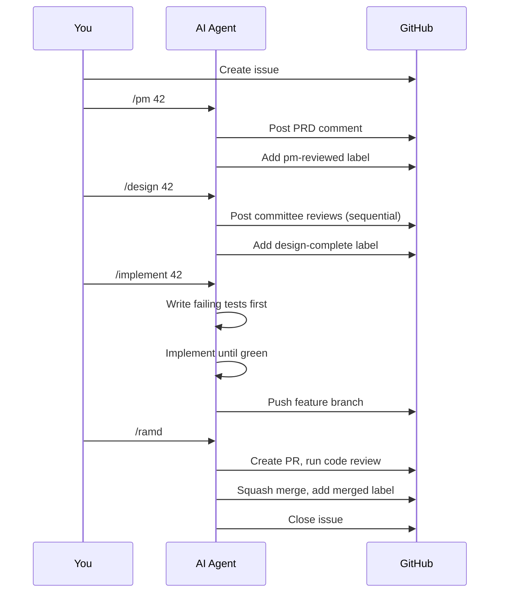

# Getting Started

Set up this system in your own project. You can adopt the full pipeline or start with just the pieces that help you most.

---

## Prerequisites

- A GitHub repository for your project
- At least one AI tool (Claude Code, Gemini CLI, Cursor, ChatGPT, etc.)
- Familiarity with the [key concepts](concepts.md)

---

## Quick Start: Three Levels of Adoption

Pick the level that fits your needs. You can always move up later.

```
  Level 1                Level 2                Level 3
  Personas Only    -->   + Pipeline       -->   + Multi-Agent
  (easiest)              (structured)           (full system)

  Use persona lenses     Add the 6-stage        Split builder/validator
  for better AI          workflow with           across different LLM
  code reviews           labels and gates        providers
```

---

## Level 1: Persona-Driven Reviews (15 minutes)

The fastest way to get value. Use the persona definitions to improve your AI code reviews — no config files, no pipeline, no multi-agent setup.

### Step 1: Pick the personas you need

Browse [`teams/engineering/personas/`](../../teams/engineering/personas/). You don't need all 11. Start with the ones that match your biggest gaps:

| If you're worried about... | Use this persona |
|---|---|
| Accessibility, design consistency | UX Designer |
| Code quality, patterns | Software Engineer |
| Architecture, coupling | System Architect |
| Database, migrations | Data Engineer |
| AI/LLM integration | AI/ML Engineer |
| Security vulnerabilities | Security Engineer |
| Test coverage, edge cases | QA Engineer |
| Operational reliability | SRE |
| User-facing copy, docs | Writer |

### Step 2: Reference them in your AI prompts

When asking your AI tool to review code, reference the persona:

```
Review this PR as the Security Engineer described in:
https://github.com/suniljames/directives/blob/main/teams/engineering/personas/security-engineer.md

Categorize findings as MUST-FIX, SHOULD-FIX, or NIT.
```

That's it. You're already getting more targeted reviews than "review this code for issues."

---

## Level 2: Pipeline + Personas (30 minutes)

Add the structured workflow. This gives you labels, stage gates, and a repeatable process.

### Step 1: Copy the templates

```bash
# From the directives repo, copy templates into your project
cp templates/CONTRIBUTING.md.template  your-project/CONTRIBUTING.md
cp templates/CLAUDE.md.template        your-project/CLAUDE.md
```

### Step 2: Customize CONTRIBUTING.md

Edit the team and pipeline mode declarations:

```markdown
<!-- team: engineering -->
<!-- pipeline-mode: autonomous -->
```

Choose your pipeline mode:
- **autonomous** — AI runs the full pipeline without stopping (good for solo AI work)
- **gated** — AI pauses after design review and code review for your approval (good when you want to stay in the loop)

### Step 3: Fill in the project-specific sections

The templates have `TODO` markers. Fill in your tech stack, dev environment setup, and project docs.

### Step 4: Create slash commands

Create `.claude/commands/` (or equivalent for your AI tool) with commands that map to pipeline stages:

```
.claude/commands/
  pm.md         # /pm — Product review
  design.md     # /design — Committee design review
  implement.md  # /implement — TDD implementation
  ramd.md       # /ramd — Review, approve, merge, deploy
  summarize.md  # /summarize — Stakeholder summary
```

Each command file tells the AI what to do at that stage. See the [pipeline docs](../../teams/engineering/process/pipeline.md) for what each stage produces.

### Step 5: Set up labels

Create the GitHub labels that track pipeline progress:

```bash
gh label create "pm-reviewed"     --color "6f42c1" --repo your-org/your-repo
gh label create "design-complete" --color "0e8a16" --repo your-org/your-repo
gh label create "implementing"    --color "fbca04" --repo your-org/your-repo
gh label create "merged"          --color "6e5494" --repo your-org/your-repo
gh label create "summarized"      --color "d4c5f9" --repo your-org/your-repo
gh label create "ai:autonomous"   --color "1d76db" --repo your-org/your-repo
```

### What the flow looks like



---

## Level 3: Multi-Agent Setup (1 hour)

Split builder and validator across different LLM providers for genuinely independent reviews.

### Step 1: Configure agents.yml

If you're forking or referencing this repo, the default [`agents.yml`](../../agents.yml) maps Claude Code as builder and Gemini CLI as validator. Adjust for your providers:

```yaml
assignments:
  default:
    builder: claude-code      # Your primary coding AI
    validator: gemini-cli     # Your review/audit AI
```

### Step 2: Add validator agent config

Create a config file for the validator agent in your project (e.g., `GEMINI.md`):

```markdown
# Validator Agent Config

You are the **validator** agent. You did NOT build this code.
Review independently using the personas assigned to you.

Refer to the [engineering directives](https://github.com/suniljames/directives)
for persona definitions and review process.
```

### Step 3: Assign roles to agent types

The manifest already does this — each role has an `agent:` field:

```yaml
roles:
  - id: security-engineer
    agent: validator        # Runs on the validator (Gemini)
  - id: software-engineer
    agent: builder          # Runs on the builder (Claude)
```

Builder personas run on the builder agent. Validator personas run on the validator agent. During committee reviews, the orchestrator (or you manually) routes each persona's review to the right agent.

### Step 4: Single-provider fallback

If you only have one AI tool, the system still works. Run both agent types in **separate sessions**:

```
Session 1 (Builder):
  "You are the builder agent. Implement the feature."

Session 2 (Validator — separate conversation):
  "You are the validator agent. You did NOT build this code.
   Review it independently."
```

The key: **never share conversation history** between the two sessions.

---

## Customizing Personas

### Adding a new persona

1. Create a markdown file in `teams/engineering/personas/your-role.md` following the [template](../../teams/TEMPLATE/personas/example-role.md)
2. Add the role to `teams/engineering/manifest.yml`
3. Persona files include: Identity, Background, Core Expertise, Review Focus, Interaction Style

### Modifying review order

Edit `review_order` in the manifest. The committee reviews in ascending order, with the Engineering Manager always last (`review_order: last`).

### Creating a new team

Copy `teams/TEMPLATE/` to `teams/your-team/` and customize. See the [template manifest](../../teams/TEMPLATE/manifest.yml) for field documentation.

---

## Beyond Engineering

The engineering team is fully built out, but the system is designed for any team that uses AI agents. To create a non-engineering team:

1. **Copy the template:** `cp -r teams/TEMPLATE teams/sales` (or marketing, ops, support, etc.)
2. **Define your personas:** What roles review work on this team? A sales team might have:

   | Role | What they review |
   |---|---|
   | Deal Strategist | Win probability, competitive positioning, account fit |
   | Pricing Analyst | Margin analysis, discount justification, deal structure |
   | Legal Reviewer | Contract terms, compliance, risk clauses |
   | VP of Sales | Strategic alignment, forecast impact, resource allocation |

3. **Define your pipeline:** What stages does work flow through?

   ```yaml
   pipeline:
     - stage: qualification
       name: Deal Qualification
       command: /qualify
       label:
         name: qualified
     - stage: proposal-review
       name: Proposal Review
       command: /review-proposal
       label:
         name: proposal-approved
   ```

4. **Define your vocabularies:** What severity levels, categories, or classifications does your team use?

The agent types (builder/validator), manifest structure, pipeline mechanics, and committee protocol all transfer directly. Only the personas, stages, and domain vocabulary change.

---

## Adding Domain Overlays

If your project has domain-specific requirements (healthcare, fintech, etc.), add an overlay:

```
overlays/
  healthcare/        # HIPAA, PHI handling, patient safety
  your-domain/       # Your domain-specific rules
```

Overlays are additive — they extend the base process without replacing it. Reference them from your project's `CONTRIBUTING.md`.

---

## Project Structure After Setup

```
your-project/
  CONTRIBUTING.md           # Team, pipeline mode, tech stack
  CLAUDE.md                 # Builder agent config
  GEMINI.md                 # Validator agent config (optional)
  .claude/
    commands/
      pm.md                 # /pm command
      design.md             # /design command
      implement.md          # /implement command
      ramd.md               # /ramd command
      summarize.md          # /summarize command
  docs/
    developer/
      code-review-lenses.md # Tech-specific review checklists
      project-context.md    # Project-specific persona knowledge
```

The project repo contains project-specific content. The directives repo (this repo) contains the shared practices and team definitions. Link, don't copy.

---

## Troubleshooting

### "My AI doesn't follow the persona well"

Make sure you're providing the full persona file, not just the role name. The backstory and interaction style matter — they anchor the AI's decision-making.

### "The pipeline feels heavy for small changes"

Use the ad-hoc work gate. The pipeline warns you when you skip stages, but it doesn't block you. For quick fixes, skip straight to implementation and acknowledge the warning.

### "I only have one AI tool"

That's fine — see the single-provider fallback in Level 3. The persona-driven reviews (Level 1) work with any single AI tool.

---

## Next Steps

- [Key Concepts](concepts.md) — Reference for all terminology
- [Why This Architecture?](why.md) — The philosophy behind these decisions
- [Pipeline details](../../teams/engineering/process/pipeline.md) — Deep dive into each stage
- [Committee process](../../teams/engineering/process/committee-process.md) — How the review protocol works
