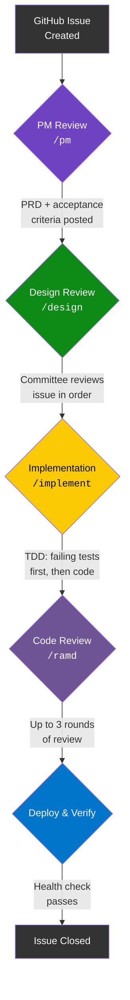

# Why This Architecture?

The thinking behind the system. Read this if you want to understand *why* the pieces exist, not just *what* they do.

---

## The Problem: AI Agents Are Powerful but Unreliable Alone

AI coding assistants can write, test, deploy, and document software. But when a single model does all of that, it creates **correlated failure modes**:

```
                Single AI Agent
                      |
          +-----------+-----------+
          |           |           |
       Builds      Reviews     Deploys
       the code    the code    the code
          |           |           |
          +-----+-----+-----+----+
                |           |
         Same blind spots   Same assumptions
         in ALL phases      in ALL phases
```

The model that wrote a SQL query won't notice it's injectable during review — it just wrote it that way on purpose. The model that chose an architecture won't question it during code review — it already decided this was the right approach. This is the AI equivalent of grading your own homework.

---

## Solution 1: Split the Builder and the Validator

The first insight: **the model that builds should not be the model that validates.**

```
     Builder Agent                    Validator Agent
     (Claude Code)                    (Gemini CLI)
          |                                |
    Implements code                  Reviews code
    Runs tests                       Audits security
    Deploys                          Writes specs
          |                                |
          +---------- Handoff via ----------+
                    GitHub Issues,
                    PRs, Labels
```

This isn't about which AI is "better." It's about **independence**. Two different models trained on different data, with different architectures and different biases, will catch different things. The overlap in what they miss is smaller than what either misses alone.

### What if you only have one provider?

The system handles this gracefully. When only one LLM provider is available, it runs both agent types in **isolated sessions** — separate conversations with no shared context. The validator session is explicitly primed: "You did NOT build this code. Review it independently."

Is this as good as two different models? No. But it's significantly better than a single session that builds and reviews in the same conversation.

---

## Solution 2: Personas Create Depth That Generic Prompting Can't

The second insight: **telling an AI to "review this code" produces shallow feedback. Telling it to review as a specific persona produces deep, targeted feedback.**

Compare:

| Generic prompt | Persona-driven prompt |
|---|---|
| "Review this PR for issues" | The Security Engineer reviews through their lens: injection vectors, auth bypass, data exposure, CSRF, multi-tenant leakage |
| Surface-level observations | Deep domain expertise applied systematically |
| "Looks good, maybe add some tests" | "MUST-FIX: This endpoint accepts user input at line 47 without sanitization. An attacker could inject SQL via the `name` parameter." |

Each persona has:

- **A backstory** — Not for flavor, but to anchor the AI's decision-making. A Security Engineer "who spent 8 years doing red-team penetration testing at CrowdStrike" reviews differently than a generic "security reviewer."
- **Core expertise** — What they're qualified to evaluate.
- **A review lens** — The specific checklist of things they look for.
- **An interaction style** — How they communicate findings (direct, diplomatic, etc.).

### Why 11 personas?

Because software engineering is genuinely multi-disciplinary. A feature that's architecturally sound might be inaccessible. Code that passes all tests might have a SQL injection vulnerability. A deployment that works might have no health checks.

```
                        A single PR
                             |
     +-------+-------+------+------+-------+-------+
     |       |       |      |      |       |       |
    UX    Code    Arch    Data   Security  QA    SRE   ...
   a11y  quality  coupling perf  vulns    tests  ops
   design patterns  scale  index  auth   edges  logs
   motion  DRY    tenant  migrate CSRF  mocks  health
```

No single reviewer — human or AI — can hold all of these lenses simultaneously. The persona system makes them explicit and systematic.

---

## Solution 3: A Pipeline Prevents Skipping Steps

The third insight: **without a defined workflow, AI agents (like humans) will skip steps under pressure.**

The pipeline enforces a sequence:



Each stage:
- Has a **label** (`pm-reviewed`, `design-complete`, etc.) that tracks completion
- **Checks** for the previous stage's label before proceeding
- **Produces artifacts** the next stage consumes (PRD, test spec, code, review comments)

If you skip the PM review and jump to implementation, the system warns you. You can override it (it's advisory, not a hard block), but you have to make a conscious choice.

### Why labels instead of a database?

Because the source of truth should live where the work lives — GitHub. Labels are visible, inspectable, and don't require any additional infrastructure. An orchestrator can read them. A human can read them. Either can advance the pipeline.

---

## Solution 4: Manifests Make the System Configurable

The fourth insight: **hardcoding personas, pipeline stages, and review order in documentation creates maintenance debt that compounds across projects.**

Instead, three config files drive everything:

```
  agents.yml                 manifest.yml               CONTRIBUTING.md
  (global)                   (per-team)                 (per-project)
  +------------------+      +------------------+       +------------------+
  | Agent types      |      | Role roster      |       | Team reference   |
  | LLM providers    | <--- | Pipeline stages  | <--- | Pipeline mode    |
  | Assignments      |      | Vocabularies     |       | Provider overrides|
  | Fallback chains  |      | Settings         |       |                  |
  +------------------+      +------------------+       +------------------+
```

Want to add a new persona? Add a role to the manifest. Change the review order? Edit one number. Swap the LLM provider? Update one line in `agents.yml`. Add a new pipeline stage? One block in the manifest. All downstream consumers automatically pick up the change.

### Why three files instead of one?

Because the three files have different **scopes** and change at different **rates**:

- `agents.yml` changes when you add a new LLM provider (rare)
- `manifest.yml` changes when you adjust the team or process (occasional)
- `CONTRIBUTING.md` changes when a specific project needs a different mode (per-project)

Separating them means a project-specific override doesn't require editing global configuration.

---

## Solution 5: Fresh-Eyes Validation Catches What Committees Miss

The fifth insight: **committee members build shared context during review. This context doesn't always make it into the final issue description.**

```
  Committee reviews issue
  (9 members + Engineering Manager)
         |
         v
  Rich shared context built
  through sequential discussion
         |
         v
  Issue description updated
  with final plan
         |
         v
  But did ALL the context        <-- This is the gap
  make it into the description?
         |
         v
  Fresh-eyes sub-agent reads
  ONLY the description
  (zero prior context)
         |
         v
  Flags gaps: "What does 'the
  existing pattern' mean here?
  I don't see it defined."
```

This is inspired by Anthropic's [doc-coauthoring skill](https://github.com/anthropics/skills/tree/main/skills/doc-coauthoring) "Reader Testing" pattern. A zero-context agent simulates the experience of the developer who will actually implement the work, catching assumptions that feel obvious to the committee but aren't captured in the spec.

---

## Design Principles

These principles guided every architectural decision:

### 1. Decouple roles from providers

Personas are abstract. "Security Engineer" doesn't mean "Gemini." It means "the agent type that reviews for security." This lets you swap LLM providers without rewriting your process.

### 2. The repo is the source of truth

All coordination happens through files, PRs, issues, labels, and comments. No side channels, no databases, no shared state outside Git. Any orchestrator — or a human — can participate.

### 3. Advisory gates, not hard blocks

The pipeline warns you when you skip stages. It doesn't prevent you. This respects the reality that sometimes you need to ship a hotfix without a full committee review.

### 4. Configuration over convention

Don't make people read documentation to figure out the review order or pipeline stages. Put it in a machine-readable manifest that both humans and orchestrators can consume.

### 5. Additive domain overlays

Healthcare needs HIPAA. Fintech needs PCI. These are *additions* to the base process, not replacements. The overlay pattern keeps domain rules separate from engineering fundamentals.

---

## Next Steps

- [Key Concepts](concepts.md) — Quick reference for all the terminology
- [Getting Started](getting-started.md) — Set this up in your own project
