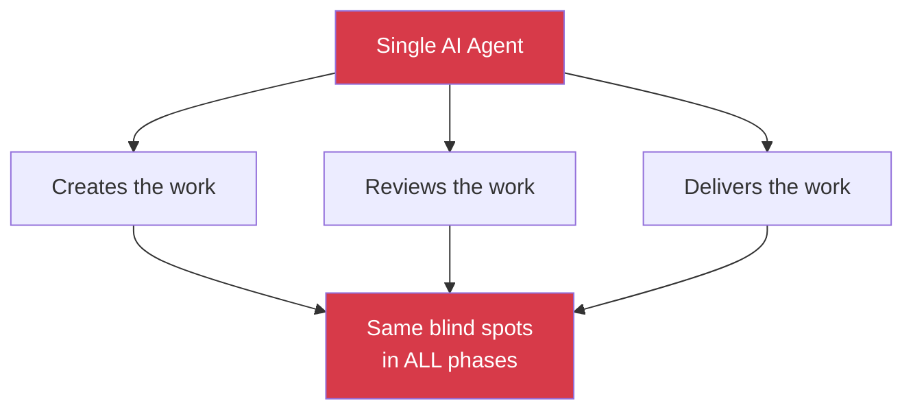
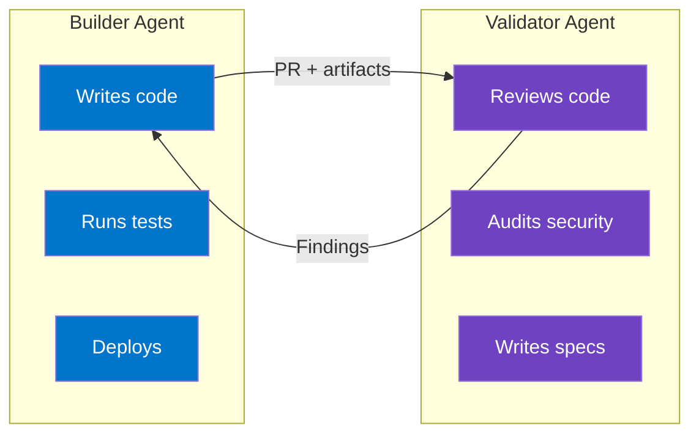
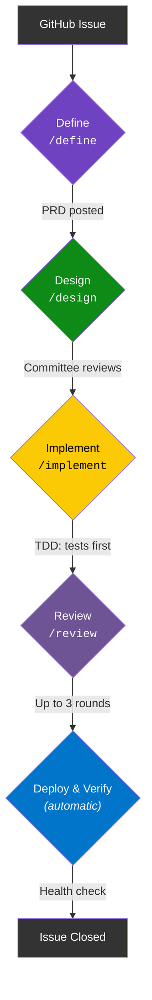
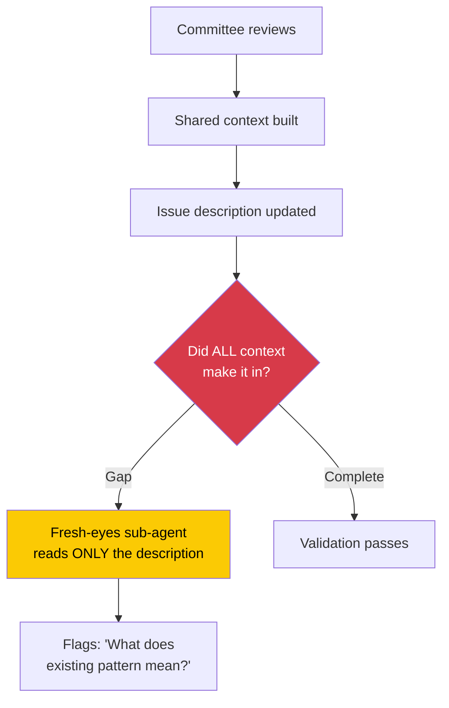

# Why This Architecture?

The thinking behind the system. Read this to understand *why* the pieces exist, not just *what* they do.

---

## The Problem: One Agent, Correlated Failures

AI agents can create, review, and deliver work across many domains. But when one model does all of that, its blind spots repeat in every phase. The model that wrote a SQL query won't notice it's injectable during review — it wrote it that way on purpose. The model that drafted a proposal won't catch the pricing error during QA — it chose those numbers.

This is grading your own homework — and the grade is always generous.

**Non-technical example:** Imagine a marketing team where the same person writes the ad copy, reviews it for brand compliance, and approves the budget. They'll miss the same things at every step because they made the original decisions. A fresh pair of eyes catches what familiarity hides.

---

## Solution 1: Split Builder and Validator

**Key insight: the model that builds should not validate.**

Two different models with different training, architectures, and biases catch different things. The overlap in what they miss shrinks significantly — each model's blind spots are unlikely to line up with the other's.

### What if you only have one provider?

The system runs both [agent types](glossary.md) in **isolated sessions** — separate conversations with no shared context. The validator is primed: *"You did NOT create this work. Review it independently."*

Not as good as two genuinely different models, but significantly better than one session doing everything. The key is that the validator has no memory of the builder's reasoning, so it can't inherit the builder's assumptions.

---

## Solution 2: Personas Create Depth

**Key insight: "review this code" produces shallow feedback. A specific [persona](glossary.md) produces targeted, deep feedback.**

| Generic prompt | Persona-driven prompt |
|---|---|
| "Review this PR for issues" | Security Engineer reviews for: injection, auth bypass, data exposure, CSRF |
| "Looks good, maybe add some tests" | "MUST-FIX: This endpoint accepts user input at line 47 without sanitization. SQL injection via `name` parameter." |

The difference isn't just specificity — it's the entire way the agent thinks about the problem. Each persona has:

- **A backstory** — anchors decision-making by giving the agent a professional identity (not decoration)
- **Core expertise** — what they evaluate and what they know deeply
- **A review lens** — a specific checklist of things to find
- **An interaction style** — how they communicate findings and how blunt they are

### Why multiple?

Real work is multi-disciplinary. Architecturally sound code might be inaccessible. Code passing all tests might have a SQL injection. A sales proposal with great positioning might have wrong pricing.

No single reviewer — human or AI — holds all lenses simultaneously. [Personas](glossary.md) make each lens explicit and ensure nothing falls through the cracks because "someone else was supposed to check that."

---

## Solution 3: Pipeline Prevents Skipping Steps

**Key insight: without a defined workflow, agents (like humans) skip steps under pressure.**

Each stage has a **label** tracking completion, **checks** the previous label, and **produces artifacts** the next stage consumes. This creates a chain of accountability — you can look at any issue and immediately see where it is in the process.

Skip Define and jump to Implement? The system warns you. You can override — it's advisory, not a hard block — but you make a conscious choice rather than accidentally skipping something important.

### Why labels, not a database?

The source of truth lives where the work lives — GitHub. Labels are visible, inspectable, and need zero infrastructure. Anyone looking at an issue can see its pipeline state without special tooling.

---

## Solution 4: Manifests Make It Configurable

**Key insight: hardcoding personas, stages, and review order in docs creates maintenance debt.**

When process definitions live in prose, they drift. Someone updates the persona list but forgets to update the pipeline doc. Machine-readable manifests solve this — change one file, and the change is immediately authoritative.

Three config files drive everything:

| File | Scope | Changes when... |
|------|-------|----------------|
| `agents.yml` | Global | You add an LLM provider (rare) |
| `manifest.yml` | Per-team | You adjust the team or process (occasional) |
| `CONTRIBUTING.md` | Per-project | A project needs a different mode (per-project) |

Add a persona → one manifest entry. Change review order → edit one number. Swap LLM provider → update one line. Add a team → copy `teams/TEMPLATE/` and fill in roles.

---

## Solution 5: Fresh-Eyes Validation

**Key insight: [committee](glossary.md) members build shared context during review. That context doesn't always make it into the final spec.**

During discussion, committee members develop a shared understanding of the problem. But whoever implements the work wasn't part of that discussion — they'll only see the final spec. A zero-context agent simulates that experience, reading only the final output and flagging anything that requires context the reader wouldn't have. This catches the "curse of knowledge" problem — assumptions that feel obvious to the people who discussed them but aren't written down.

---

## Design Principles

| Principle | What it means |
|-----------|--------------|
| **Decouple roles from providers** | "Security Engineer" means a review role, not "Gemini." Swap providers without rewriting process. |
| **Repo is the source of truth** | All coordination through files, PRs, issues, labels. No side channels, no external databases. |
| **Advisory gates, not hard blocks** | Pipeline warns when you skip stages. Doesn't prevent you. Hotfixes happen. |
| **Configuration over convention** | Machine-readable manifests, not documentation you have to interpret. |
| **Additive domain overlays** | Healthcare needs HIPAA. Fintech needs PCI. Additions, not replacements. |
| **Team-agnostic scaffolding** | The architecture doesn't assume engineering. Any team can fill it with their own content. |

---

## Next Steps

- [Key Concepts](concepts.md) — Quick reference for all terminology
- [Getting Started](getting-started.md) — Set this up in your own project
- [Glossary](glossary.md) — Definitions for every term
